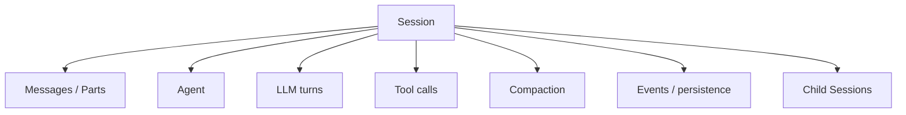
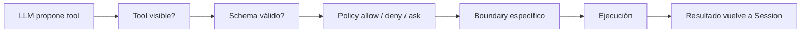
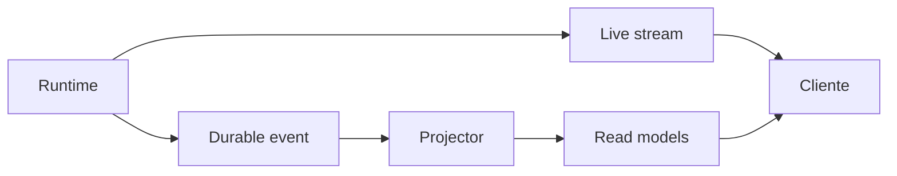
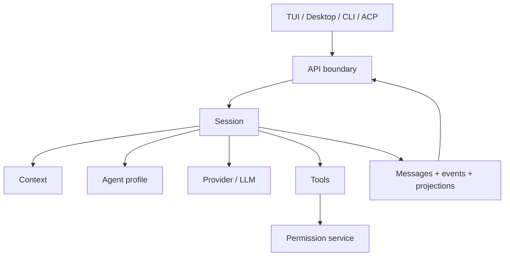

# 00 — Léeme primero: cinco ideas que hacen encajar OpenCode

OpenCode es más fácil de entender cuando dejas de imaginarlo como “un chatbot con terminal”. El código encaja mejor si lo ves como un **runtime de sesiones que usa un LLM como motor de decisión**.

## 1. La unidad fundamental es la Session

Un modelo puede ser sustituido. Una request HTTP termina. Una tool call dura segundos. La **Session** es lo que conserva continuidad entre todos esos elementos.

En una sesión aparecen o se relacionan:

- mensajes de usuario y assistant;
- reasoning y texto incremental;
- tool calls y resultados;
- agente y modelo elegidos;
- compaction y continuidad;
- subagentes como sesiones hijas;
- eventos y proyecciones persistentes;
- estado observable por TUI, Desktop, SDK y ACP.

## 2. `dev` es híbrido, no una arquitectura terminada

Este es el punto más importante de la auditoría.

En `dev` coexisten una superficie todavía compuesta en `packages/opencode` y una arquitectura V2 sustancial extraída a `packages/core`, `packages/llm`, `packages/server`, `packages/protocol`, etc.

Ejemplos:

- `SessionPrompt` sigue siendo un path de producto real.
- `SessionRunner` V2 también existe y es real.
- AI SDK sigue siendo el runtime por defecto del `SessionPrompt` actual.
- el stack nativo `@opencode-ai/llm` ya es consumido directamente por Core V2.
- el listener/server host sigue en `packages/opencode`, aunque contratos y handlers ya se extraen a packages separados.

Por eso, una frase como “OpenCode usa X” casi siempre necesita responder antes: **¿en qué pipeline?**

## 3. El LLM propone; el runtime gobierna

El modelo puede pedir una tool, pero no es autoridad de seguridad.

Antes de ejecutar una acción intervienen varias capas:

Esto es especialmente visible en shell, edición de archivos, `apply_patch`, subagentes y Code Mode.

## 4. “Evento live” y “hecho durable” no son lo mismo

Durante streaming se publican deltas útiles para la UI. No todos esos deltas deben interpretarse como entradas durables individuales del event log.

Piensa en tres capas:

- **live/published:** lo que permite ver actividad en tiempo real;
- **durable:** hechos persistidos y secuenciados para recovery/replay;
- **projection:** la vista materializada que una API/cliente consulta.

En EventV2, el ordering durable por aggregate se basa en `seq`; un aggregate nuevo empieza en `seq = 0`.

## 5. La API es un boundary incluso cuando no hay red

La TUI puede ejecutar el backend en un Worker y llamar `app.fetch()` sin socket TCP. Desktop puede usar un sidecar. Un servidor headless sí puede escuchar por red.

La idea constante es la misma: **los clientes consumen el backend mediante un contrato API**, no importando directamente el runtime del agente.

Eso permite cambiar el despliegue sin reescribir la semántica del cliente.

## Modelo mental final

Si recuerdas sólo una frase:

> **OpenCode es una máquina de continuidad alrededor de Session; el LLM es una pieza central, pero no es el sistema entero.**

### Fuentes profundas

- [`analysis/01-dev/README.md`](./analysis/01-dev/README.md)
- [`analysis/CODE-TRUTH-AUDIT.md`](./analysis/CODE-TRUTH-AUDIT.md)
- [`analysis/10-effect-modularization/README.md`](./analysis/10-effect-modularization/README.md)