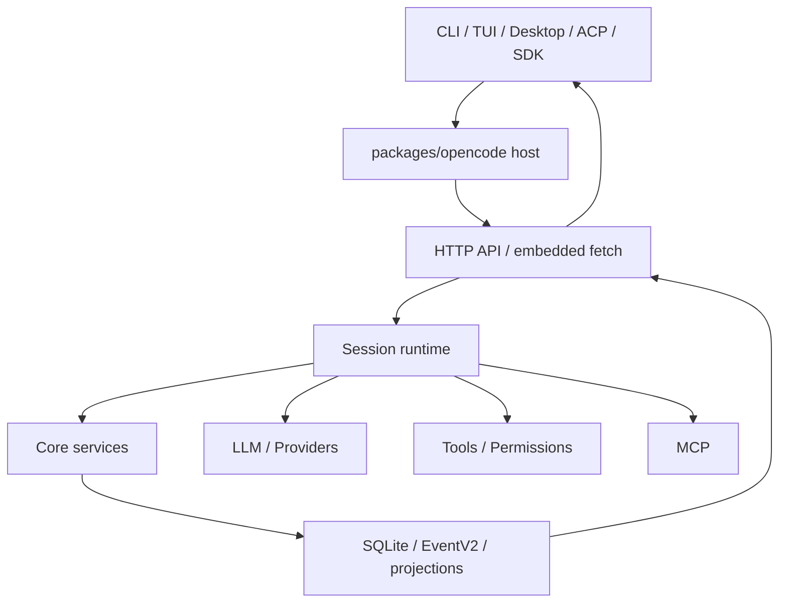
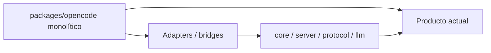

# 01 — Arquitectura de OpenCode en una página

## El sistema visto desde arriba

OpenCode es un monorepo TypeScript/Bun con una extracción progresiva hacia packages especializados. El centro operativo de `dev` sigue teniendo mucho peso en `packages/opencode`, mientras `core`, `llm`, `server`, `protocol`, `schema`, `tui`, `client` y otros packages van convirtiendo responsabilidades antes internas en boundaries explícitos.



## Las capas útiles para razonar

### 1. Surfaces

Son las maneras de usar OpenCode:

- CLI interactiva o non-interactive;
- TUI;
- servidor headless;
- Desktop/Electron;
- SDK/clientes;
- ACP para clientes compatibles con Agent Client Protocol.

No son runtimes de agente distintos. Acaban entrando en el mismo universo de Session/API/services.

### 2. Application host

`packages/opencode` sigue siendo el gran composition shell del producto vigente. Allí viven entrypoints, server listener, compatibilidad, SessionPrompt, integración de tools, providers, MCP, ACP y bridges hacia la nueva arquitectura.

Esto explica por qué `packages/opencode` no puede llamarse todavía “legacy muerto”.

### 3. Domain/runtime

Aquí están Session, event/persistence, context, execution, tools y otros servicios que progresivamente se extraen a Core.

Core V2 intenta que esas piezas sean más portables, explícitas y componibles.

### 4. LLM boundary

OpenCode evita que cada capa conozca directamente los detalles de OpenAI, Anthropic, Gemini o Bedrock.

En el stack nativo:

```text
LLMRequest -> Route -> Protocol adapter -> Transport -> Provider
Provider stream -> Protocol adapter -> LLMEvent
```

El path de producto actual todavía usa AI SDK por defecto y puede seleccionar el runtime nativo mediante flag experimental; Core V2 consume el runtime nativo directamente.

### 5. Capability boundary

Tools son capacidades ejecutables. Permission decide si una invocación concreta puede ocurrir. MCP puede aportar tools externas. Skills aportan contexto especializado, no ejecución autónoma.

### 6. State boundary

SQLite, events y projectors permiten separar:

- hechos durables;
- estado transitorio;
- vistas de lectura;
- streaming live.

No todo se persiste de la misma manera ni con el mismo ordering.

## Control plane y data plane

Una forma práctica de entender Desktop y el server es separar dos preocupaciones.

**Control plane local:** quién arranca, para, autentica o descubre el backend.

**Data plane:** requests HTTP/fetch, SSE, WebSocket PTY y eventos usados durante el trabajo normal.

Desktop main supervisa el sidecar y entrega URL/credenciales. El renderer consume después la API.

## El patrón de migración

La arquitectura actual se parece a un patrón strangler:



No hay un “día cero” donde todo lo anterior desaparezca. Nuevos boundaries se introducen y se integran mientras el composition root conserva compatibilidad.

## Qué no es OpenCode

- No es un único loop `while(true)` sin estado.
- No es un frontend que ejecuta herramientas directamente.
- No es un sistema donde el provider define la semántica interna.
- No es event sourcing puro de todos los deltas del LLM.
- No ha completado todavía la sustitución universal de AI SDK por el stack nativo.

## Tres invariantes que ayudan a navegar el código

1. **Session posee continuidad.**
2. **Backend/runtime posee autoridad.** La UI observa y responde, pero no concede seguridad por sí sola.
3. **Los boundaries nuevos se deben validar en el composition root.** Que un package exista no significa que sea el path por defecto.

### Fuentes profundas

- [`analysis/01-dev/01-arquitectura-y-boundaries.md`](./analysis/01-dev/01-arquitectura-y-boundaries.md)
- [`analysis/09-backend-transports/README.md`](./analysis/09-backend-transports/README.md)
- [`analysis/10-effect-modularization/README.md`](./analysis/10-effect-modularization/README.md)