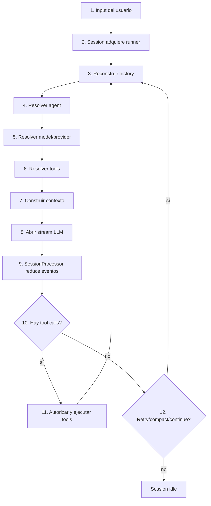
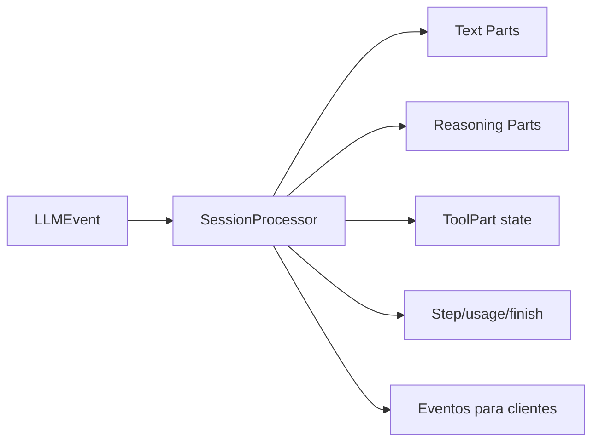

# 02 — El viaje de un turno: de “haz esto” a una Session en idle

Esta es la historia más útil para entender OpenCode.

Imagina que el usuario escribe: **“Busca dónde se calcula el coste y corrige el bug.”**

No ocurre una sola llamada al modelo. Se inicia o continúa un pequeño workflow stateful.

## El flujo completo

## 1. El input entra en una Session

El input no es sólo un string que se manda inmediatamente al provider. Se materializa dentro de la conversación/sesión para que forme parte de la continuidad.

## 2. Se serializa la ejecución

`SessionRunState` evita que la misma Session tenga runners incompatibles trabajando sin coordinación. El estado `busy`/`idle` es operativo y transitorio; no es una columna durable que deba sobrevivir a un crash.

## 3. Se reconstruye el contexto válido

Aquí entran:

- historial anterior;
- mensajes/parts;
- compaction previa;
- tools interrumpidas que necesiten normalización;
- instrucciones y contexto de proyecto;
- trabajo sintético pendiente.

Una tool que quedó `running` cuando murió el proceso no puede reenviarse ingenuamente al provider como una llamada sin resultado. El builder normaliza ese transcript.

## 4. Se selecciona el Agent

Un Agent es un perfil de ejecución: prompt, modelo opcional, variant, sampling, step limit y permisos.

No es el dueño de la historia. La Session lo es.

## 5. Se resuelve modelo y provider

La identidad lógica del modelo se traduce a un provider/runtime ejecutable y a sus opciones efectivas.

En el path `packages/opencode`, AI SDK sigue siendo el default; el native runtime puede entrar bajo `experimentalNativeLlm`. En Core V2 se consume el stack nativo directamente.

## 6. Se construye el catálogo de tools

No todas las herramientas existentes se muestran al modelo.

Se combinan builtin, plugins/custom, MCP, flags, capacidades y permisos. Tools globalmente denegadas pueden desaparecer antes de que el modelo las vea.

## 7. Se compone el contexto

El prompt efectivo puede contener:

- system base/model-specific;
- environment;
- instrucciones de proyecto;
- catálogo de skills;
- instrucciones MCP;
- mensajes normalizados;
- agente y otras capas dinámicas.

## 8. Se abre el stream del modelo

El runtime no espera necesariamente una respuesta monolítica. Recibe un stream normalizado de texto, reasoning, tool input/call, lifecycle, usage y errores.

## 9. SessionProcessor convierte stream en dominio

Este componente se parece más a un **reducer** que a un simple concatenador.

## 10–11. Si hay tools, el turno se expande

Una tool call puede pasar por:

- validación de schema;
- hooks;
- policy de permisos;
- aprobación humana `ask`;
- boundary de filesystem;
- ejecución y cancelación;
- truncado de output;
- persistencia del resultado.

Ese resultado vuelve a la Session y normalmente provoca otro model turn.

Por eso “un prompt” puede convertirse en varias iteraciones modelo ↔ tools.

## 12. Continuar, compactar, reintentar o terminar

El runtime decide si debe:

- continuar con el siguiente step;
- reintentar un fallo recuperable;
- compactar porque el contexto está cerca del límite;
- detenerse por error/interrupción;
- finalizar limpiamente.

Sólo entonces la Session vuelve a `idle`.

## Qué ve el usuario

Mientras esto ocurre, el cliente puede ver deltas live, status, tool progress y permisos. El backend sigue siendo la autoridad del estado.

### Una frase para recordar

> Un turno de OpenCode es una **transacción conversacional multi-step**, no una sola llamada al LLM.

### Fuentes profundas

- [`analysis/01-dev/02-entrypoints-y-runtime.md`](./analysis/01-dev/02-entrypoints-y-runtime.md)
- [`analysis/07-session-message-events/03-state-machine-steps.md`](./analysis/07-session-message-events/03-state-machine-steps.md)