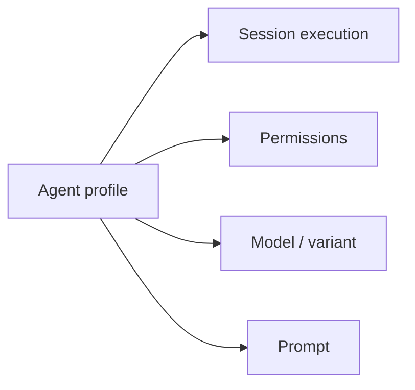
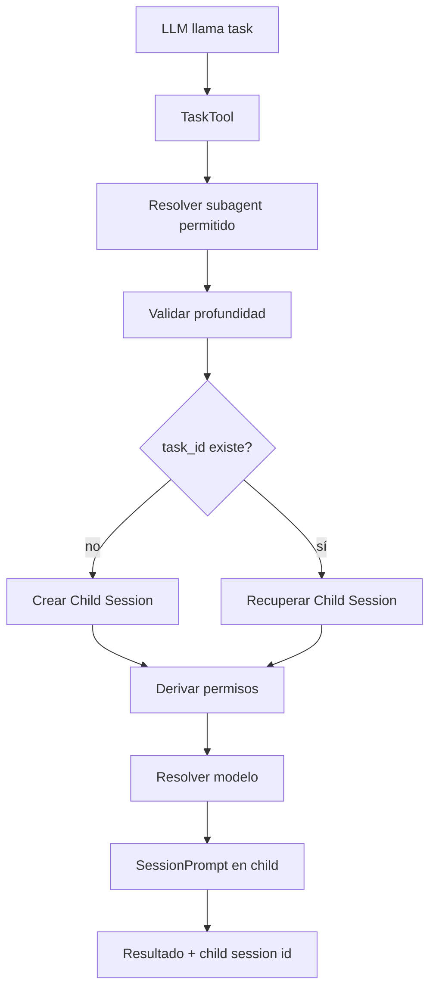
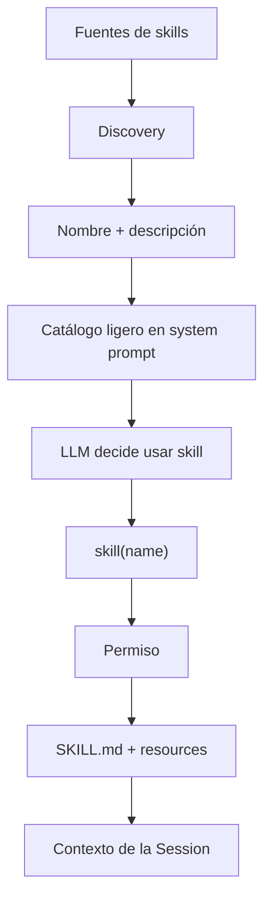

# 03 — Agents, subagents y skills: tres conceptos que parecen iguales y no lo son

## Agent: “cómo quiero ejecutar”

En `dev`, un agent es principalmente un **perfil declarativo** (`Agent.Info`). Puede definir o influir en:

- system/prompt;
- modelo y variant;
- sampling;
- límite de steps;
- permissions;
- modo primary/subagent.

El agent configura una ejecución; no reemplaza a Session como unidad de continuidad.



## Subagent: “abre una conversación hija para delegar”

El spawning boundary real es `TaskTool`.

Cuando el LLM llama `task`, OpenCode no crea un actor completamente distinto. Crea o reutiliza una **Session hija**.



### `task_id` es continuidad

Si se devuelve y reutiliza `task_id`, el subagente continúa en la misma Session hija y conserva su historial.

Eso convierte la delegación en algo más parecido a “retomar a un colaborador con memoria de su tarea” que a lanzar una función efímera.

### Nesting

`subagent_depth` limita la recursión. El default `1` permite que la sesión raíz delegue, pero evita por defecto que un subagente lance otro subagente.

### Permisos heredados

El child **no clona todos los privilegios del padre**.

Se preservan restricciones importantes —especialmente `deny` y `external_directory`— mientras las capacidades funcionales dependen del propio agent hijo. Si no declara ciertas capacidades como `task`/`todowrite`, se deniegan por defecto según el path actual.

## Skill: “carga conocimiento especializado cuando haga falta”

Una skill no tiene loop ni Session propia. Es un paquete de instrucciones/contexto, normalmente `SKILL.md`.

La idea actual es **lazy activation**:



Esto evita meter el contenido completo de todas las skills en cada request.

### Fuentes

La discovery ha evolucionado para admitir fuentes OpenCode y compatibilidad específica con `.claude/skills` y `.agents/skills`, además de paths configurados y algunas fuentes remotas/cacheadas.

## Agent vs Subagent vs Skill

| Concepto | Qué aporta | Tiene Session propia | Ejecuta tools |
|---|---|---:|---:|
| Agent | política/configuración de ejecución | no por sí mismo | según permisos |
| Subagent | delegación aislada | sí, child Session | sí, según su policy |
| Skill | instrucciones especializadas | no | no por sí misma |

## Background subagents

Existe soporte/líneas experimentales de ejecución background. La documentación auditada recalca que el registry background actual es process-local y no equivale a una cola durable recuperable tras restart.

Foreground y background tienen lifetimes distintos: foreground suele propagar cancelación del caller; background necesita desacoplar la espera y notificar posteriormente.

## Insight arquitectónico

El diseño reutiliza Session para delegación en vez de inventar una segunda máquina de ejecución. Eso reduce conceptos fundamentales:

```text
main agent execution = Session + Agent profile
subagent execution    = Child Session + Agent profile
```

### Fuentes profundas

- [`analysis/03-agent-subagent-skills/README.md`](./analysis/03-agent-subagent-skills/README.md)
- [`analysis/03-agent-subagent-skills/03-subagents-delegacion/README.md`](./analysis/03-agent-subagent-skills/03-subagents-delegacion/README.md)
- [`analysis/03-agent-subagent-skills/06-skills/README.md`](./analysis/03-agent-subagent-skills/06-skills/README.md)