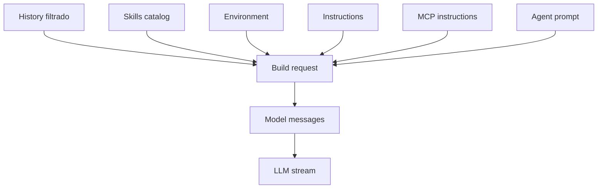
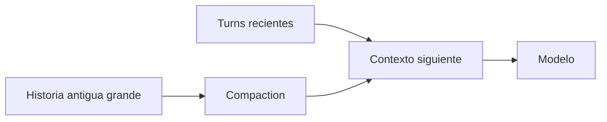

# 04 — Prompt, contexto y compaction: qué recuerda el modelo y cómo cabe todo

## Primero: existen dos pipelines

La auditoría encontró un error fácil de cometer: mezclar el pipeline de producto de `packages/opencode` con el runner V2 de `packages/core`.

### Path de producto actual

```text
SessionPrompt
 + SystemPrompt
 + Instruction
 + MessageV2
 + SessionCompaction
 + SessionProcessor
 + LLM
```

### Path Core V2

```text
SessionRunner
 + SystemContextRegistry
 + SessionContextEpoch
 + SessionHistory
 + compaction V2
 + LLMClient
```

Los dos existen en `dev`. Sus reglas no son idénticas.

## Cómo se construye el contexto en el path de producto

Antes de llamar al modelo, `SessionPrompt` reconstruye historial y combina varias fuentes.



`Instruction.Service` sigue vigente. Puede resolver instrucciones como `AGENTS.md`, `CLAUDE.md`, configuración y otras fuentes, incluyendo instrucciones relacionadas con paths leídos.

## Por qué no se carga todo siempre

El presupuesto de contexto es finito. OpenCode aplica carga selectiva:

- skills: catálogo primero, contenido completo al activarlas;
- prompts/resources MCP: varias superficies se consultan bajo demanda;
- outputs de tools antiguos pueden reducirse;
- historial antiguo puede compactarse.

La pregunta práctica siempre es: **¿esta información debe estar disponible o debe ocupar tokens ahora?**

## Compaction no es “borrar mensajes viejos”

La compaction construye una representación resumida que permite seguir trabajando sin reenviar toda la historia original.

En el path `packages/opencode`, la implementación:

- usa un agent de compaction;
- conserva una cola reciente;
- reserva un presupuesto configurable;
- reduce material antiguo y tool outputs;
- puede podar resultados históricos grandes.



## Overflow

Overflow y compaction están relacionados, pero no son sinónimos.

### `packages/opencode`

`session/overflow.ts` calcula contexto utilizable con límites de modelo, reserva de compaction y output. Si `compaction.auto === false`, no fuerza auto-compaction.

### Core V2

El runner V2 puede compactar de forma proactiva y dispone de recovery reactivo de `context-overflow` bajo condiciones más estrictas: antes de que haya empezado output assistant y con reintento acotado.

No hay que atribuir ese comportamiento automáticamente al `SessionPrompt` actual.

## ContextEpoch en V2

Core V2 introduce una idea importante: mantener un baseline/snapshot de contexto por Session y representar cambios posteriores de manera ordenada. Esto ayuda a separar “contexto de partida” de “nuevas instrucciones/contexto aparecido durante la sesión”.

Es una dirección arquitectónica relevante, pero no debe describirse como el único mecanismo del producto actual.

## Continuidad

El siguiente request no se construye copiando ciegamente el transcript. Puede necesitar:

- filtrar historia compactada;
- reconstruir tool exchanges válidos;
- insertar contexto dinámico;
- preservar metadata provider-specific necesaria para reasoning/tool continuation;
- aplicar límites y transforms del provider.

## Modelo mental

```text
Contexto efectivo =
  historia válida
  + instrucciones relevantes
  + entorno
  + agent
  + skills activas/catálogo
  + MCP
  - historia podada/compactada
  - contenido que excede presupuesto
```

### Fuentes profundas

- [`analysis/04-prompt-context-compaction/README.md`](./analysis/04-prompt-context-compaction/README.md)
- [`analysis/04-prompt-context-compaction/03-compaction/README.md`](./analysis/04-prompt-context-compaction/03-compaction/README.md)
- [`analysis/CODE-TRUTH-AUDIT.md`](./analysis/CODE-TRUTH-AUDIT.md)