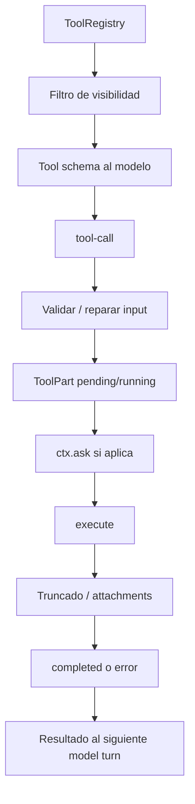
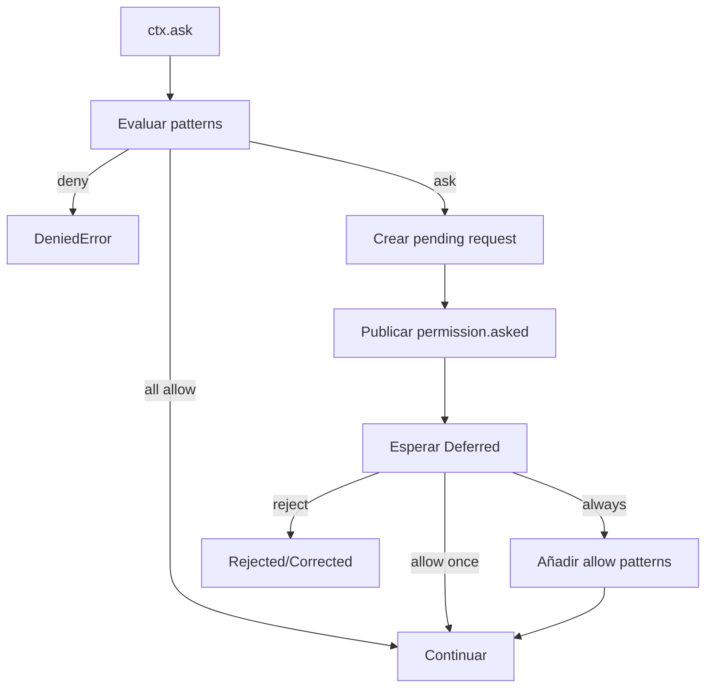
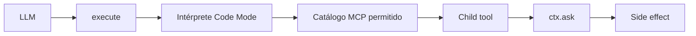

# 05 — Tools, permisos y Code Mode: cómo el agente actúa sin tener carta blanca

## Una tool es una capability tipada

El contrato común define identidad, descripción, schema de parámetros y `execute(params, ctx)`.

`ctx` aporta Session/message/call IDs, agent, `AbortSignal`, metadata incremental y `ask()` para autorización.

Eso es importante: **la tool no pregunta al frontend directamente**. Pide una decisión al Permission Service del runtime.

## Pipeline de una tool call



## Registry

El registry no es una simple constante. Combina:

- builtin tools;
- custom/plugins;
- capabilities dependientes del modelo;
- flags/configuración;
- MCP;
- servicios de instancia.

## Dos niveles de permisos

### 1. Visibilidad

Una tool globalmente denegada puede ni siquiera enviarse al LLM. Esto reduce llamadas imposibles.

### 2. Autorización contextual

Una tool visible todavía puede necesitar autorización para **esa invocación concreta**.

Ejemplos:

- shell: comando y directorios;
- edit/apply_patch: paths afectados;
- task: tipo de subagente;
- Code Mode: child-tool concreta;
- filesystem externo: permiso `external_directory`.

## Policy: allow, deny, ask

La regla conceptual es:

```text
permission + pattern -> allow | deny | ask
```

En el baseline actual, la última regla coincidente gana. La precedencia es **por orden**, no por “la regla más específica”.

## `ask` suspende realmente el runtime



La UI presenta la pregunta, pero el bloqueo real está en backend.

## `always` no significa “permite todo”

Sólo incorpora los patterns que la propia request ofrece como reutilizables y reevalúa otras solicitudes pendientes de la Session.

## Shell

Shell combina varias defensas:

- parseo/análisis del comando;
- patterns de autorización;
- `external_directory` cuando sale del boundary;
- streaming y cancelación;
- kill escalonado;
- truncado incremental de output.

## `apply_patch`

El patrón esencial es:

```text
parse -> calcular targets/diff -> validar boundaries -> pedir edit -> mutar
```

La autorización ocurre **antes** de escribir/eliminar/mover.

## Code Mode

Code Mode presenta una tool exterior, `execute`, que ejecuta código sobre un catálogo de child-tools MCP ya filtrado.

La clave de seguridad es que la autorización no termina en la tool exterior. Cada child invocation vuelve a atravesar permisos, hooks, timeout y abort.



## Output grande

OpenCode diferencia dos problemas:

- **guardar/mostrar output operativo:** `tool/truncate.ts` puede dejar preview y fichero temporal completo;
- **no inflar el contexto futuro:** `message-v2.ts` puede reducir resultados antiguos al reconstruir mensajes.

## Insight

El LLM posee intención. El runtime posee capacidades, policy y side effects.

### Fuentes profundas

- [`analysis/05-tools-permissions-codemode/01-tool-runtime.md`](./analysis/05-tools-permissions-codemode/01-tool-runtime.md)
- [`analysis/05-tools-permissions-codemode/02-permissions.md`](./analysis/05-tools-permissions-codemode/02-permissions.md)
- [`analysis/05-tools-permissions-codemode/07-security-boundaries.md`](./analysis/05-tools-permissions-codemode/07-security-boundaries.md)