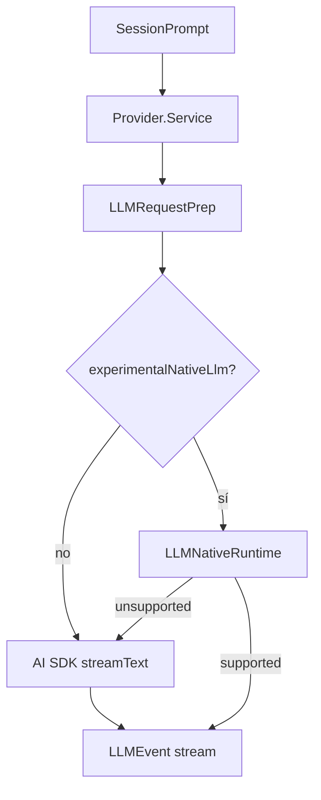
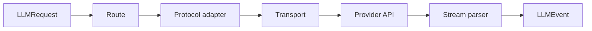

# 06 — Providers, LLM y streaming: una lengua común para muchos modelos

## La verdad incómoda y útil: hay dos consumidores

En `dev` existe un stack nativo potente en `packages/llm`, pero el path de producto `packages/opencode/src/session/llm.ts` **todavía usa AI SDK por defecto**.



Core V2, en cambio, consume `LLMClient`/`@opencode-ai/llm` directamente.

## Provider no es Protocol

Un provider describe cosas como endpoint, auth, defaults y routes. Un protocol describe cómo convertir entre el modelo interno y un wire format.

Esto permite reutilizar protocolos en deployments distintos.



Protocolos nativos observados incluyen:

- OpenAI Responses;
- OpenAI Chat / compatible Chat;
- Anthropic Messages;
- Gemini;
- Bedrock Converse.

## Route: el punto de composición

La route combina:

- defaults/opciones;
- cache policy;
- lowering al body del protocolo;
- validación;
- auth/headers/endpoint;
- preparación del transporte.

La compilación puede ocurrir antes del I/O real.

## Streaming normalizado

El runtime intenta que Session no dependa de nombres de eventos de cada vendor.

El vocabulario común incluye:

- `text-start/delta/end`;
- `reasoning-start/delta/end`;
- `tool-input-*`, `tool-call`, `tool-result`, `tool-error`;
- `step-start`, `step-finish`, `finish`;
- `provider-error`.

La respuesta completa puede reconstruirse reduciendo ese stream.

## Tools ejecutadas por el provider

Algunos proveedores ejecutan capacidades server-side. `providerExecuted: true` permite distinguirlas de las tools locales para que OpenCode no intente ejecutarlas de nuevo.

## Reasoning continuity

Reasoning no siempre es sólo texto. Algunos protocolos exigen metadata opaca para continuar correctamente:

- OpenAI: item/reasoning state;
- Anthropic: signatures;
- Gemini: thought signatures;
- Bedrock: reasoning signatures.

OpenCode la conserva en metadata provider-specific. No debe asumirse que ese estado puede moverse entre providers diferentes.

## Retry y errores

El executor nativo clasifica errores de transporte/provider y aplica retry a categorías/status recuperables. Esto es distinto del retry de Session o del recovery de context overflow.

Separar estas capas evita confundir:

```text
falló el HTTP/provider
vs
el modelo necesita otro step
vs
el contexto no cabe
```

## Caching

El runtime común puede aplicar políticas de cache, pero la representación final depende del protocolo. Anthropic/Bedrock pueden usar markers explícitos; otros providers reportan caching de otra manera.

No existe una garantía universal de “prompt cache” con la misma semántica.

## Usage y coste

Los adapters normalizan tokens de input/output, cache y reasoning cuando la API los ofrece. El runtime LLM no debería ser la tabla de precios: usage y pricing son responsabilidades separables que una capa superior puede combinar.

## Insight

`packages/llm` intenta convertir a muchos vendors en una máquina conceptual común sin borrar las diferencias que sí son necesarias para continuidad, auth o billing.

### Fuentes profundas

- [`analysis/06-providers-llm-responses/README.md`](./analysis/06-providers-llm-responses/README.md)
- [`analysis/06-providers-llm-responses/architecture/runtime-comun.md`](./analysis/06-providers-llm-responses/architecture/runtime-comun.md)