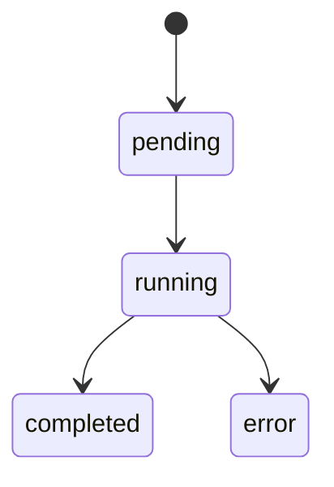
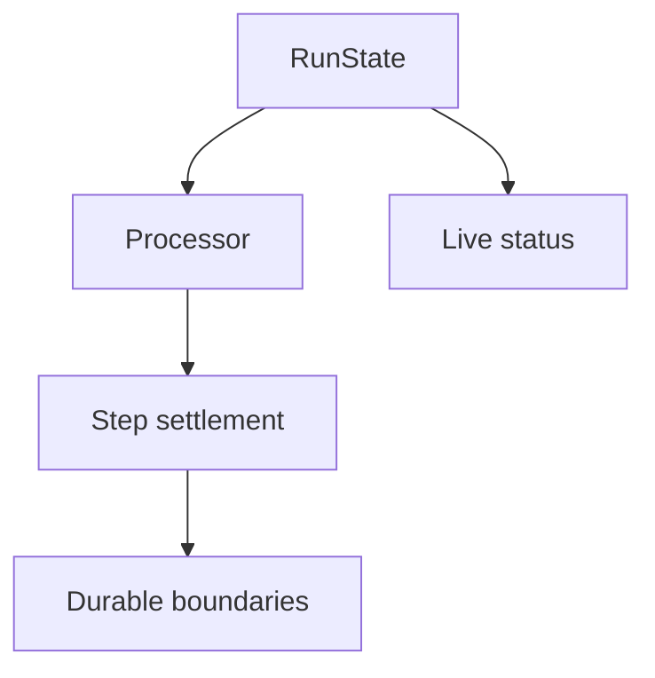
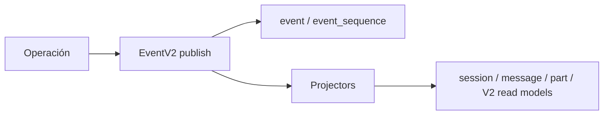

# 07 — Sessions, mensajes y eventos: dónde vive la memoria operativa

## Session es la identidad larga

Una Session agrupa una conversación y su ejecución a través de múltiples model turns, tools, compactions, interrupciones y reanudaciones.

Un subagente también usa Session: simplemente es una child Session con `parentID`.

## Messages y Parts

El contenido no se reduce a `role + text`. La conversación necesita representar:

- texto;
- reasoning;
- tool calls;
- tool results/errors;
- steps;
- metadata/usage;
- attachments y otros parts.

Por eso el processor trabaja sobre parts y estados, no sólo concatenando tokens.

## ToolPart tiene lifecycle

Al reanudar una Session después de una interrupción, parts incompletos pueden normalizarse a resultados de error para producir un transcript válido para el provider.

## Hay varias “máquinas de estado” superpuestas

No existe un enum universal que lo explique todo.

- `SessionRunState`: quién posee el runner activo y cancelación.
- `SessionStatus`: `busy/retry/idle` observable y transitorio.
- `SessionProcessor`: lifecycle de text/reasoning/tools.
- runner/steps V2: retry, compaction, continuation y settlement.
- durable events: hechos replayables.

## Live no significa durable

Un `text-delta` puede ser importante para renderizar streaming sin necesitar convertirse en un registro durable independiente.

EventV2 y el bridge separan el plano de hechos persistentes del plano de publicación live.

## EventV2

Los eventos durables por aggregate usan secuencia.

- aggregate nuevo: `latest = -1`;
- primer evento: `seq = 0`;
- después incrementa.

El replay sobre una secuencia ya existente es estricto: para considerarse idempotente deben coincidir identidad, type persistido/versionado y data.

## Projectors

Un evento durable puede actualizar read models dentro de la misma transacción SQLite mediante projectors registrados.

Esto permite que APIs consulten proyecciones cómodas sin pedir al cliente que reconstruya todo el dominio desde cero.

## Ordering: no hay uno solo

La auditoría corrige una simplificación común:

- durable EventV2: `aggregateID + seq`;
- history/message V2: sequence;
- `SessionV2.list()`: `time_created` + ID como desempate;
- surfaces legacy pueden usar otras claves;
- live chunks siguen el orden del stream, pero no son necesariamente durable.

## Fork vs child Session

No son sinónimos.

- `parentID`: relación estructural parent/child usada, entre otras cosas, para subagentes.
- `Session.fork()`: crea otra Session remapeando historia/parts según la semántica de fork.

## Recovery

El diseño intenta que un restart no dependa de conservar todo el estado transitorio en memoria. El runtime puede reconstruir suficiente contexto desde historia/durable state y normalizar operaciones incompletas.

Eso no significa que todo sea durable: por ejemplo, ciertos registries background siguen siendo process-local.

### Fuentes profundas

- [`analysis/07-session-message-events/README.md`](./analysis/07-session-message-events/README.md)
- [`analysis/07-session-message-events/03-state-machine-steps.md`](./analysis/07-session-message-events/03-state-machine-steps.md)
- [`analysis/07-session-message-events/04-eventos-streaming-ordering.md`](./analysis/07-session-message-events/04-eventos-streaming-ordering.md)