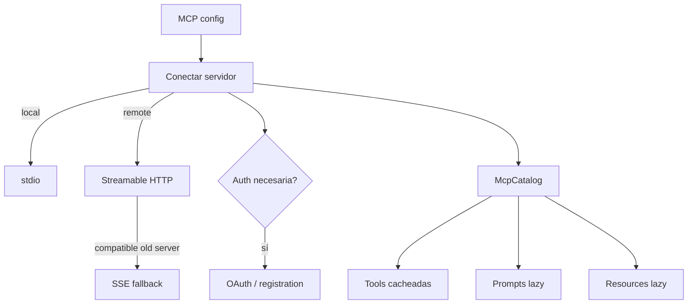
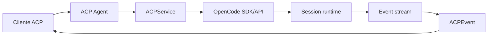

# 08 — MCP y ACP: dos protocolos, dos problemas distintos

Los nombres se parecen, pero cumplen papeles muy diferentes.

- **MCP** conecta OpenCode con servidores que ofrecen tools, prompts y resources.
- **ACP** permite que un cliente/IDE hable con OpenCode como agente mediante un protocolo externo.

## MCP: extensibilidad hacia fuera

OpenCode mantiene un servicio MCP stateful por instancia/proyecto.

### Conexiones

- local: `StdioClientTransport`;
- remoto: intenta Streamable HTTP y usa SSE como fallback;
- OAuth forma parte del lifecycle.

Los errores de auth se distinguen de fallos de transporte para no ocultar un challenge OAuth probando otro transport sin sentido.

### Namespaces

Tools de varios servidores entran en un catálogo común con nombres derivados del servidor, reduciendo colisiones.

### Invalidación

`tools/list_changed` puede invalidar/refrescar la vista de tools. Esto explica por qué MCP terminó siendo un servicio con estado y lifecycle, no un simple “load tools once”.

## ACP: una anti-corruption layer

ACP no reemplaza el runtime de OpenCode.

OpenCode conserva ownership de:

- Session;
- modelo/agent;
- tools y permisos;
- persistencia;
- MCP;
- event stream.

ACP traduce requests y eventos a su wire contract.

## Session lifecycle en ACP

`newSession`, `loadSession`, `resumeSession` y fork se proyectan sobre Sessions persistentes de OpenCode.

Un prompt ACP se transforma a parts internos, se envía a la Session y el adapter espera hasta observar `idle` antes de considerar completo el turno.

## Streaming ACP

`ACPEvent` escucha el stream global y traduce cosas como:

- `message.part.delta`;
- `message.part.updated`;
- `permission.asked`;
- `session.status`.

Tool calls ACP son una **vista** del `ToolPart` interno; ACP no gobierna la state machine de la tool.

## Permisos ACP

Cuando OpenCode publica una solicitud de permiso, el adapter puede convertirla a `requestPermission` ACP. La decisión vuelve al Permission Service real.

## MCP suministrado desde ACP

Un cliente ACP puede suministrar definiciones de servidores MCP. ACP no ejecuta esas tools como proxy: registra la configuración y OpenCode establece/posee las conexiones MCP.

## Subagentes y ACP

OpenCode modela un subagente como child Session real. ACP puede tener una única sesión lógica visible al cliente. Una línea de evolución proyecta actividad child hacia la root ACP añadiendo metadata de child session y evitando colisiones de tool call IDs.

Es un buen ejemplo de anti-corruption layer: no fuerza a ambos modelos a ser idénticos.

## Elicitation

Hubo una evolución específica de ACP elicitation, pero `unstable_createElicitation` no está implementado en la baseline `dev` auditada. Debe considerarse histórico/experimental, no capacidad vigente.

### Fuentes profundas

- [`analysis/08-mcp-acp/README.md`](./analysis/08-mcp-acp/README.md)
- [`analysis/08-mcp-acp/mcp/arquitectura-y-lifecycle.md`](./analysis/08-mcp-acp/mcp/arquitectura-y-lifecycle.md)
- [`analysis/08-mcp-acp/acp/arquitectura-sesiones-eventos.md`](./analysis/08-mcp-acp/acp/arquitectura-sesiones-eventos.md)