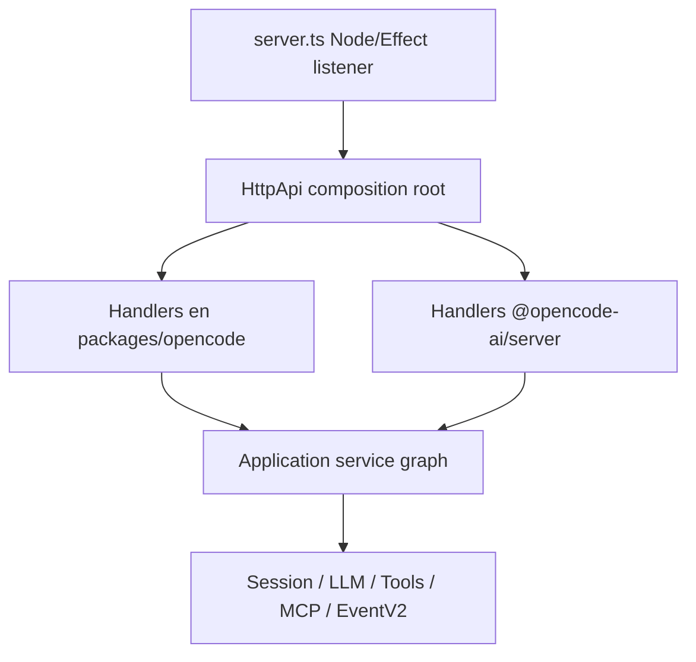
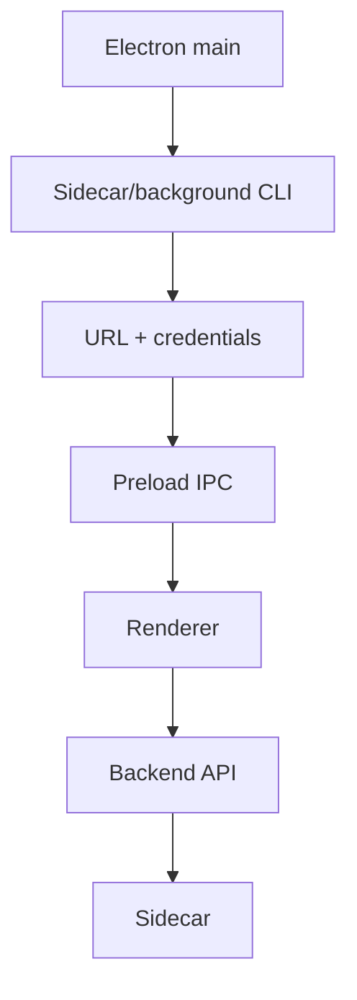

# 09 — Backend, TUI y Desktop: el mismo motor detrás de varias superficies

## El servidor vigente es híbrido

El listener/application host actual sigue en `packages/opencode/src/server`.

A la vez, parte de los contratos y handlers ya se han extraído a `packages/server` y `packages/protocol`.



Esto es extracción incremental, no una sustitución terminada.

## Embedded y network comparten semántica

`Server.Default()` puede exponer `app.fetch`, mientras `Server.listen()` monta el mismo tipo de handler sobre Node HTTP.

Por eso OpenCode puede usarse sin socket y seguir pasando por el boundary API.

## TUI normal

Sin necesidad de red, la TUI puede arrancar un backend en Worker.

```mermaid
flowchart LR
    TUI[TUI] --> RPC[RPC fetch/EventSource]
    RPC --> W[Worker]
    W --> FETCH[Server.Default().app.fetch]
    FETCH --> API[HttpApi]
```

La URL `http://opencode.internal` puede ser lógica: lo importante es que Request/Response atraviesan la misma semántica de API.

Si el usuario pide hostname/port/mDNS, el Worker puede arrancar listener real y el cliente usa URL y auth reales.

## Desktop

Electron main funciona como supervisor, no como runtime cognitivo.



El renderer espera una barrera de inicialización antes de usar el API.

### Sidecar generations

`dev` conserva un selector entre un path legacy/v1 y un background CLI/daemon V2. Ambos convergen en el mismo contrato práctico: endpoint + credenciales.

## Eventos

El backend publica un stream global SSE y otras surfaces de history/events. El SSE extraído usa buffering/heartbeat para mantener la conexión live.

`EventV2Bridge` puede adaptar eventos durables hacia el bus global y añadir payload `sync` con sequence/aggregate/type/data.

## WebSocket

WebSocket no es el transporte general del backend. PTY es un caso bidireccional especial que sí lo necesita.

Las líneas históricas de WebSocket RPC no deben confundirse con el default HTTP/HttpApi actual.

## Sincronización de clientes

Una estrategia útil es combinar:

```text
live event -> sabemos que algo cambió
HTTP/read model -> obtenemos la proyección coherente
history/events -> rellenamos gaps/recovery
```

Algunos adapters de app prefieren refrescar una proyección completa al recibir ciertos deltas en vez de pedir a cada frontend que reproduzca toda la lógica de dominio.

## Control plane vs data plane

**Control plane:** spawn, stop, restart, health, credenciales, discovery.

**Data plane:** HTTP/fetch, SSE, PTY WebSocket y operaciones normales de Session.

La separación es especialmente visible en Desktop.

### Fuentes profundas

- [`analysis/09-backend-transports/README.md`](./analysis/09-backend-transports/README.md)
- [`analysis/09-backend-transports/05-desktop-embedded-synchronization.md`](./analysis/09-backend-transports/05-desktop-embedded-synchronization.md)
- [`analysis/01-dev/02-entrypoints-y-runtime.md`](./analysis/01-dev/02-entrypoints-y-runtime.md)