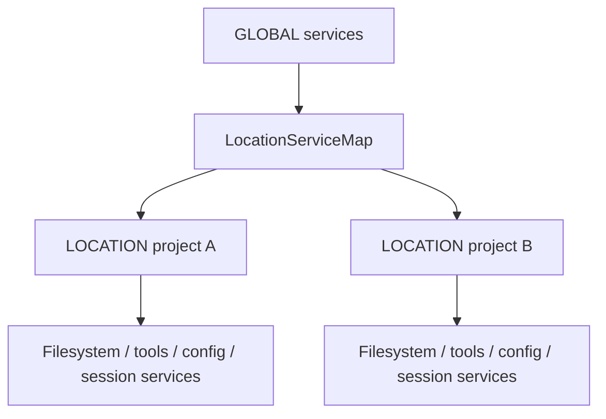
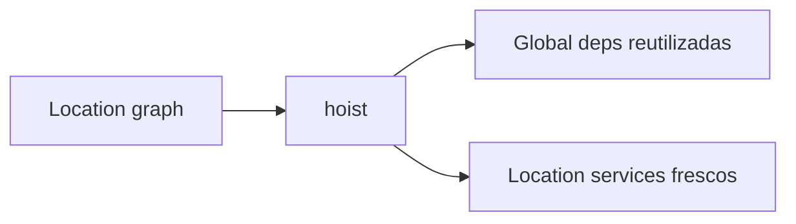

# 10 — Effect, dependencias y lifetimes: quién necesita a quién y cuánto vive

Si sólo miras imports, la arquitectura de OpenCode parece más caótica de lo que realmente es. La migración a Effect y `LayerNode` hace explícito un grafo que antes estaba implícito.

## Service + Node + dependencies

La unidad relevante no es “un namespace”. Es una combinación de:

- service/capability;
- implementación Layer;
- dependencias;
- tag/lifetime;
- scope que posee recursos/estado.

`LayerNode` puede representar nodes con implementación, puertos `unbound` y grupos.

## La regla global ↔ location

Core codifica una dirección importante:

```text
location puede depender de global
global NO puede depender directamente de location
```



Cuando un servicio global necesita operar “para una location”, no captura directamente un servicio location-scoped; usa una factory/map que materializa el subgrafo correcto.

## ¿Qué es Location?

Location representa contexto asociado a un directorio/proyecto. Muchas capacidades de dominio —filesystem, config, policy, tools, agent, watchers, etc.— tienen sentido relativas a esa location.

Eso evita tratar el filesystem del proceso como si todo el producto tuviera un único cwd global.

## Hoisting

Al construir un subgrafo location, `LayerNode.hoist` separa dependencias globales para reutilizarlas en vez de recrearlas dentro de cada project/location.



## Replacements

Tests y hosts pueden reemplazar nodes concretos, por ejemplo database, execution strategy, credentials o location.

Esto revela puertos naturales de la arquitectura: si una dependencia está diseñada para ser reemplazada sin reescribir el consumidor, probablemente sea un boundary real.

## Lifetimes

Piensa en varias escalas:

- **global/app:** database, shared services, stores;
- **instance/location:** config, filesystem contextual, tool registry, agent services;
- **session:** execution/context state relacionado con una conversación;
- **operation:** handles scoped como transportes o procesos de una acción concreta.

Un error clásico es hacer vivir demasiado un recurso corto o recrear demasiadas veces un recurso global. Effect scopes y services-factory intentan hacer ese ownership explícito.

## InstanceStore / LocationServiceMap

Estos componentes permiten que un servicio de vida larga posea/cachee estado aislado por directorio/location y lo limpie correctamente.

Eso encaja con un producto que puede servir múltiples proyectos dentro del mismo proceso/backend.

## Ports y adapters

La extracción de Core también persigue portabilidad. Plugins, filesystem, database y runtime OS usan adapters para evitar que el dominio dependa de una implementación concreta innecesariamente.

Un caso especialmente útil: el boundary de plugins no presupone que plugin y host compartan exactamente la misma instancia de Effect/Schema; se normaliza a contratos portables.

## Insight

`LayerNode` es más que DI cómoda: convierte parte de la arquitectura en **datos ejecutables y verificables**.

### Fuentes profundas

- [`analysis/10-effect-modularization/README.md`](./analysis/10-effect-modularization/README.md)
- [`analysis/10-effect-modularization/dependency-graph/README.md`](./analysis/10-effect-modularization/dependency-graph/README.md)
- [`analysis/10-effect-modularization/lifetimes-filesystem/README.md`](./analysis/10-effect-modularization/lifetimes-filesystem/README.md)