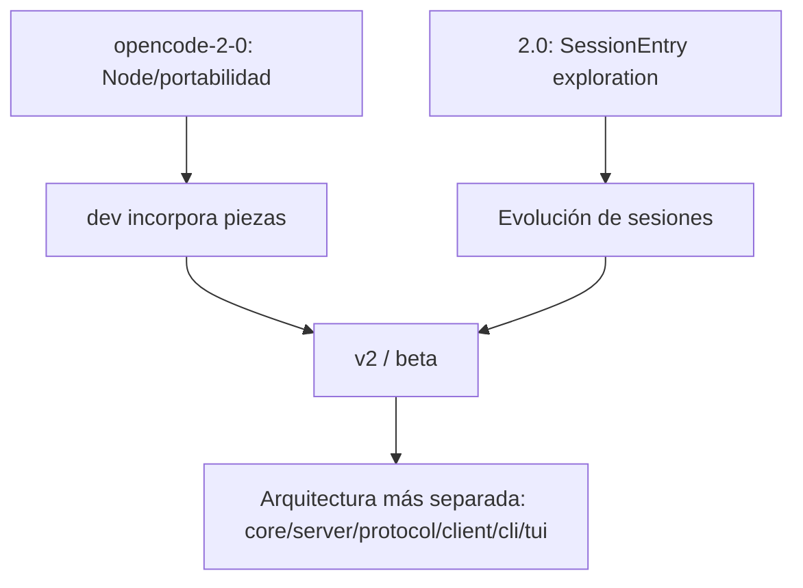
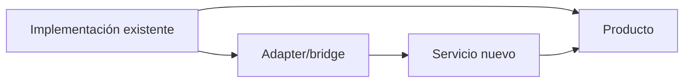

# 11 — Evolución hacia V2: por qué `dev` contiene pasado y futuro a la vez

## Las branches importantes no son cuatro arquitecturas independientes

La arqueología reconstruye varias líneas:

- `beta` y `v2` eran equivalentes en el corte analizado;
- `2.0` fue una exploración anterior centrada, entre otras cosas, en `SessionEntry`;
- `opencode-2-0` fue una mega-línea de portabilidad/desacoplamiento de Bun que no se integró como bloque, pero cuyas piezas sí se fueron extrayendo.

## Línea simplificada



## Qué persigue V2

La dirección general es pasar de un package `opencode` que contiene muchas responsabilidades a un producto compuesto por boundaries explícitos:

```text
CLI / TUI
   |
Client
   |
Protocol
   |
Server
   |
Core
   +-- Schema/durable state
   +-- AI/LLM providers
```

## Qué ya llegó a `dev`

Entre otras cosas:

- packages `core`, `server`, `protocol`, `client`, `cli`;
- portabilidad Node/Bun en puntos importantes;
- conditional runtime implementations;
- LLM layer provider-neutral/schema-first;
- EventV2/projections y Session V2 parcial;
- Effect/LayerNode y boundaries global/location;
- embedded server y extracción de handlers/contracts.

## Qué todavía no está sustituido universalmente

La auditoría insiste en esto:

- root/product composition sigue teniendo peso en `packages/opencode`;
- `SessionPrompt` sigue activo;
- AI SDK sigue siendo default en ese path;
- server listener sigue en `packages/opencode`;
- surfaces V1/legacy-compatible y V2 conviven;
- el SDK/client y otros boundaries todavía muestran compatibilidad/migración.

## Patrón strangler



En lugar de parar el mundo y reescribirlo, una funcionalidad nueva empieza a asumir autoridad en un boundary, mientras adapters y composition root mantienen compatibilidad.

## ¿Por qué esto complica la ingeniería inversa?

Porque existen tres afirmaciones diferentes:

1. **“este código existe en dev”**;
2. **“alguna surface lo usa”**;
3. **“es el path por defecto del producto”**.

Sólo la tercera permite decir sin matices “OpenCode hace X por defecto”.

## Ideas descartadas vs conceptos sobrevivientes

Una implementación puede desaparecer sin que el problema que intentaba resolver desaparezca.

Ejemplo: la forma concreta `SessionEntry` de la exploración `2.0` no sobrevivió, pero sí siguieron evolucionando identidad durable, events, messages y Session semantics.

Igualmente, la mega-branch `opencode-2-0` se descartó como unidad de integración, pero varios objetivos de portabilidad se fusionaron en PRs menores.

## Cómo leer branches históricas

Usa este orden:

1. ¿qué problema intentaba resolver?
2. ¿qué commit/diff aislado lo demuestra?
3. ¿qué parte llegó a `dev`?
4. ¿en qué forma llegó?
5. ¿es default o sólo coexistente/experimental?

No deduzcas arquitectura únicamente por el nombre de la branch.

### Fuentes profundas

- [`analysis/02-beta-v2/README.md`](./analysis/02-beta-v2/README.md)
- [`analysis/CODE-TRUTH-AUDIT.md`](./analysis/CODE-TRUTH-AUDIT.md)
- [`analysis/10-effect-modularization/lineage/README.md`](./analysis/10-effect-modularization/lineage/README.md)