# 12 — Flow charts de bolsillo

Este archivo es una chuleta visual. Cada diagrama elimina detalles para conservar sólo el recorrido esencial.

## A. Un turno normal

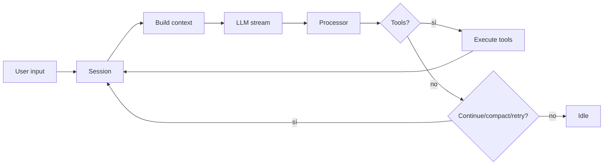

## B. Tool call con permiso

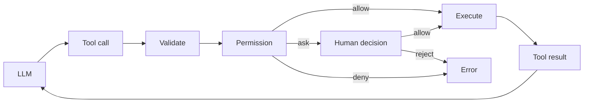

## C. Subagente

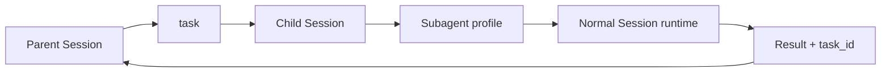

## D. Skill lazy

```mermaid
flowchart LR
    D[Discover skills] --> C[Catalog names/descriptions]
    C --> L[LLM]
    L --> S[skill(name)]
    S --> P[Permission]
    P --> F[Full SKILL.md]
    F --> CTX[Conversation context]
```

## E. Provider nativo

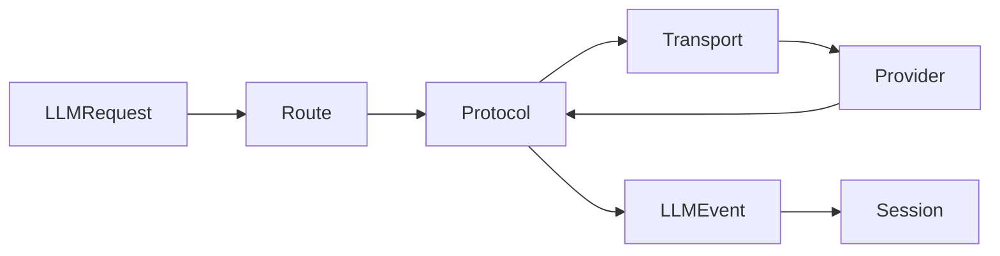

## F. Evento durable y proyección

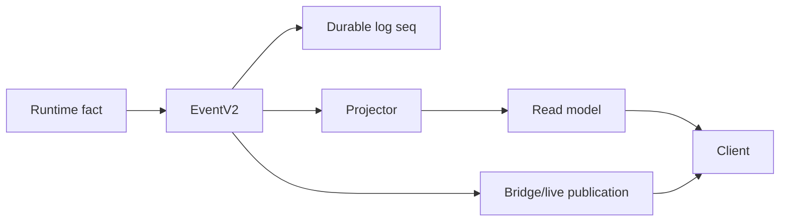

## G. MCP

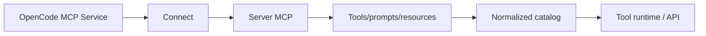

## H. ACP

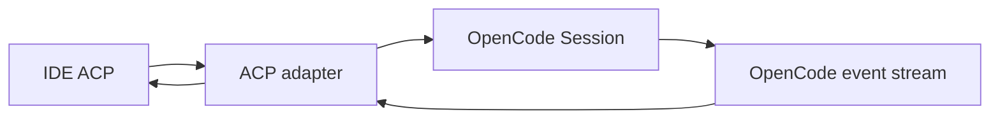

## I. TUI sin red

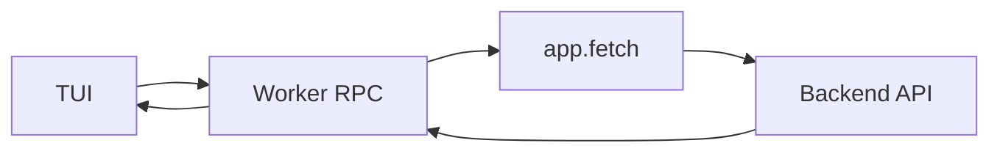

## J. Desktop

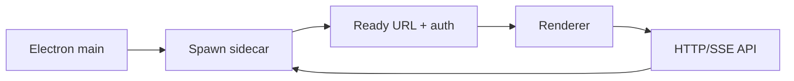

## K. Dependency graph

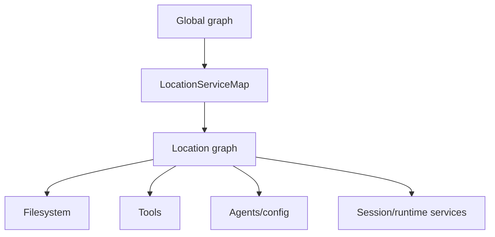

## L. Migración strangler

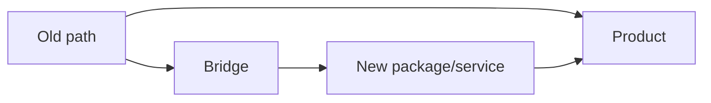

Para el porqué de cada flecha, usa el archivo `KNOWLEDGE-*` correspondiente.