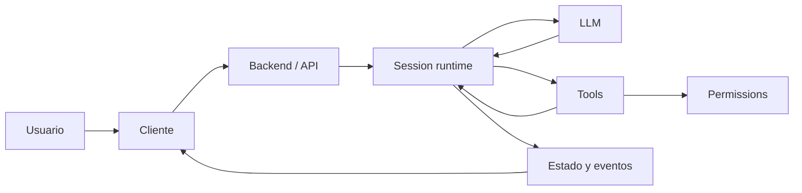

# OpenCode Reverse Engineering — Knowledge Library

Esta carpeta contiene dos capas complementarias de documentación sobre OpenCode:

1. **Knowledge Library** — los archivos `KNOWLEDGE-*.md` de esta raíz. Explican el sistema de forma resumida, visual y orientada a comprensión.
2. **Evidence Library** — `analysis/`, `OPENCODE_ARCHITETURE/` y otros árboles de investigación. Contienen evidencia, arqueología de branches, paths, commits y matices de implementación.

## Empieza aquí

Si quieres entender OpenCode sin leer cientos de archivos de código:

1. [`KNOWLEDGE-00-LEEME-PRIMERO.md`](./KNOWLEDGE-00-LEEME-PRIMERO.md)
2. [`KNOWLEDGE-01-ARQUITECTURA-EN-UNA-PAGINA.md`](./KNOWLEDGE-01-ARQUITECTURA-EN-UNA-PAGINA.md)
3. [`KNOWLEDGE-02-EL-VIAJE-DE-UN-TURNO.md`](./KNOWLEDGE-02-EL-VIAJE-DE-UN-TURNO.md)
4. Después salta al subsistema que te interese.

## Biblioteca resumida

| Archivo | Pregunta que responde |
|---|---|
| [00 — Léeme primero](./KNOWLEDGE-00-LEEME-PRIMERO.md) | ¿Qué ideas necesito para no interpretar mal OpenCode? |
| [01 — Arquitectura](./KNOWLEDGE-01-ARQUITECTURA-EN-UNA-PAGINA.md) | ¿Cuáles son las piezas grandes y cómo encajan? |
| [02 — Viaje de un turno](./KNOWLEDGE-02-EL-VIAJE-DE-UN-TURNO.md) | ¿Qué ocurre desde que escribo hasta que el agente termina? |
| [03 — Agents, subagents y skills](./KNOWLEDGE-03-AGENTS-SUBAGENTS-SKILLS.md) | ¿Qué es realmente un agente y cómo delega? |
| [04 — Prompt, contexto y compaction](./KNOWLEDGE-04-PROMPT-CONTEXTO-COMPACTION.md) | ¿Qué ve el modelo y qué ocurre cuando el contexto se llena? |
| [05 — Tools, permisos y Code Mode](./KNOWLEDGE-05-TOOLS-PERMISOS-CODE-MODE.md) | ¿Cómo ejecuta acciones sin convertir al LLM en autoridad de seguridad? |
| [06 — Providers y LLM](./KNOWLEDGE-06-PROVIDERS-LLM-STREAMING.md) | ¿Cómo habla OpenCode con OpenAI, Anthropic, Gemini, Bedrock, etc.? |
| [07 — Sessions, mensajes y eventos](./KNOWLEDGE-07-SESSIONS-MENSAJES-EVENTOS.md) | ¿Dónde vive el estado y cómo se reanuda/sincroniza? |
| [08 — MCP y ACP](./KNOWLEDGE-08-MCP-ACP.md) | ¿Cómo conecta tools externas e IDEs/clientes de agentes? |
| [09 — Backend, TUI y Desktop](./KNOWLEDGE-09-BACKEND-TUI-DESKTOP.md) | ¿Cómo se comunican las interfaces con el runtime? |
| [10 — Effect y dependency graph](./KNOWLEDGE-10-EFFECT-DEPENDENCIAS-LIFETIMES.md) | ¿Cómo se compone el sistema y quién posee cada recurso? |
| [11 — Evolución hacia V2](./KNOWLEDGE-11-EVOLUCION-HACIA-V2.md) | ¿Por qué `dev` parece contener dos generaciones a la vez? |
| [12 — Flow charts](./KNOWLEDGE-12-FLOW-CHARTS.md) | ¿Puedo ver los flujos clave de un vistazo? |
| [13 — Glosario](./KNOWLEDGE-13-GLOSARIO.md) | ¿Qué significan los términos que aparecen por todo el código? |
| [14 — Mapa al código](./KNOWLEDGE-14-MAPA-AL-CODIGO.md) | ¿Qué archivos debo abrir para investigar cada comportamiento? |

## Regla de verdad de esta biblioteca

La baseline principal de esta síntesis es `dev@dc4449df0d52199704ea4989a5a993ebbc605612`, auditada en [`analysis/CODE-TRUTH-AUDIT.md`](./analysis/CODE-TRUTH-AUDIT.md).

Prioridad usada al resolver contradicciones:

1. composition root y wiring real de `dev`;
2. implementación, schemas y tests de `dev`;
3. documentación auditada de `analysis/`;
4. branches históricas;
5. inferencias arquitectónicas, siempre señaladas como tales.

`OPENCODE_ARCHITETURE/` usa una baseline de `production` distinta. Es documentación útil, pero **no se mezclan automáticamente afirmaciones entre baselines**.

## La idea central

OpenCode no es simplemente `prompt -> modelo -> texto`. Es un runtime stateful donde una **Session** coordina contexto, modelo, tools, permisos, streaming, persistencia, eventos, subagentes y clientes.

La carpeta `analysis/` conserva la evidencia. Los `KNOWLEDGE-*` intentan que esa evidencia sea fácil de aprender.