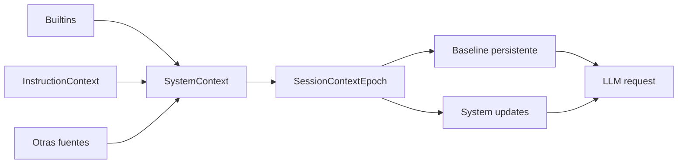

# System context y context epoch

## Resumen

**CONFIRMADO EN `dev`:** el contexto privilegiado del modelo está modelado como un conjunto de fuentes observables, no como una única cadena generada ad hoc. Las fuentes se ensamblan mediante `SystemContext`; el estado que el modelo ya conoce se persiste por sesión mediante `SessionContextEpoch`.

## Piezas principales

### `SystemContext`

Archivo: `packages/core/src/system-context/index.ts`.

Responsabilidades:

- registrar fuentes de contexto por clave estable;
- producir el baseline inicial de cada fuente;
- refrescar la fuente antes de nuevos requests;
- comparar el estado observado contra el snapshot conocido por la sesión;
- producir un `update` textual cuando cambia una fuente;
- distinguir entre una fuente realmente eliminada y una fuente temporalmente `unavailable`.

Una fuente no necesita representar instrucciones. Puede representar contexto operativo, entorno, proyecto o estado externo.

**CONFIRMADO EN `dev`:** el sistema conserva la identidad de la fuente además de su texto. Esto permite razonar sobre cambios por fuente en vez de tratar cada system message como una cadena opaca.

### Builtins

Archivo: `packages/core/src/system-context/builtins.ts`.

Entre las fuentes base aparecen datos como:

- working directory;
- workspace/project root;
- información Git;
- plataforma/entorno;
- fecha actual.

El contenido exacto puede evolucionar, pero la idea estructural es estable: datos de entorno se integran como contexto privilegiado observable.

### Instrucciones como fuente

Archivo: `packages/core/src/instruction-context.ts`.

Las instrucciones ambientales se exponen como una fuente propia de `SystemContext`. La consecuencia es importante: `AGENTS.md` y archivos equivalentes dejan de ser únicamente texto concatenado al prompt y pasan a formar parte de un estado contextual con identidad, refresh y diff.

## `SessionContextEpoch`

Archivo: `packages/core/src/session/context-epoch.ts`.

### Qué persiste

**CONFIRMADO EN `dev`:** por sesión se conserva al menos:

- baseline textual de contexto privilegiado;
- snapshot codificado de las fuentes que originaron ese baseline;
- secuencia/frontera del historial a la que corresponde;
- relación con la compaction más reciente cuando procede.

El snapshot expresa lo que el modelo ya ha sido informado sobre cada fuente. No equivale necesariamente al estado físico actual del workspace.

### Reconciliação

Antes de construir un request nuevo:

1. se observa el estado actual de las fuentes;
2. se carga el snapshot de la sesión;
3. se calculan diferencias fuente a fuente;
4. los cambios se emiten como mensajes `system` posteriores al baseline;
5. el snapshot persistido se actualiza para reflejar el contexto que el modelo acaba de recibir.

### `unavailable` no significa `removed`

**CONFIRMADO EN `dev` y reforzado por la línea `instruction-read-race`:** si una fuente no puede leerse de forma fiable durante una observación, el sistema debe evitar inferir que desapareció. De lo contrario produciría un update falso que retiraría instrucciones o contexto previamente admitido.

## Relación con `context-checkpoint`

**CONFIRMADO EN BRANCH:** `context-checkpoint` formulaba explícitamente el checkpoint como “lo que el modelo cree” sobre un conjunto de fuentes. Los updates eran mensajes system cronológicos y una compaction servía para rebaselinar.

**EVOLUCIÓN HACIA `dev`:** esa semántica se conserva, pero el diseño vigente utiliza un snapshot más estructurado y el concepto de `ContextEpoch`.

## Relación con `system-context`

**CONFIRMADO EN BRANCH:** la branch `system-context` formaliza la separación entre proveedores de contexto y el runner. Es una de las evidencias más claras de que el prompt dejó de ser responsabilidad exclusiva de `session-prompt`.

**CONFIRMADO EN `dev`:** el concepto está integrado: existe el paquete `system-context` y el runner consume su baseline/snapshot a través del epoch de sesión.

## Frontera arquitectónica



## Efecto sobre el system prompt

**CONFIRMADO EN `dev`:** la parte `system` del request no se obtiene únicamente de las instrucciones del agente. El runner combina el `system` propio del agente con el baseline privilegiado del epoch.

Los cambios de contexto ocurridos después del baseline se mantienen en el historial como mensajes `system`, conservando orden temporal.

## Fork, revert y compaction

**INFERENCIA, confianza alta:** al estar el snapshot ligado a una frontera de historial, operaciones que reescriben la historia no pueden tratar el contexto como una variable global independiente. El diseño de checkpoint/epoch existe precisamente para alinear “qué sabe el modelo” con la historia efectiva de la sesión.

La branch `context-checkpoint` hacía esta preocupación explícita. En `dev`, la persistencia por secuencia y la integración con compaction son la materialización de la misma necesidad.

## Conclusión

El boundary real no es `prompt -> string`, sino:

```text
fuentes dinámicas -> snapshot conocido por sesión -> baseline + deltas ordenados -> request
```

Esto hace que el contexto de sistema sea reproducible, incremental y durable, y permite que una conversación larga sobreviva a compactions sin perder la distinción entre estado actual, estado conocido e historia.