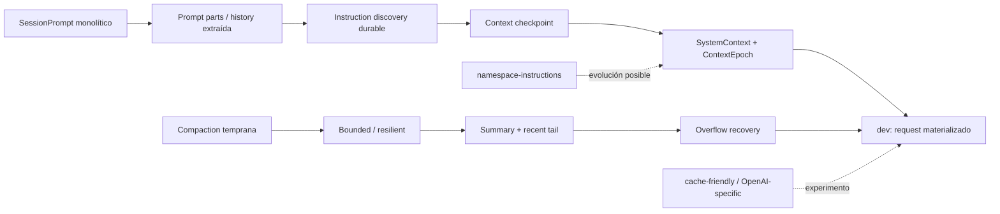

# Inventario de branches y clasificación evolutiva

## Criterio

El nombre de una branch no se toma como evidencia suficiente. Para incluir una rama como fuente arquitectónica se contrastaron commits, paths modificados y, cuando fue necesario, su divergencia respecto de `dev`.

Clasificación:

- **núcleo**: cambia construcción/reducción/recuperación del contexto que llega al LLM;
- **precursora**: diseño antiguo cuya idea aparece transformada en `dev`;
- **experimental**: alternativa no integrada literalmente;
- **adyacente**: scheduling/UI/admission relacionado, pero no cambia el contexto semántico principal;
- **nombre engañoso / evidencia insuficiente**: no debe usarse para inferir comportamiento por su nombre.

## Context state / checkpoints

| Branch | Clase | Hallazgo principal | Relación con `dev` |
|---|---|---|---|
| `context-checkpoint` | precursora, núcleo | checkpoint por fuente de “lo que el modelo cree”; updates system cronológicos; rebaseline en compaction | evoluciona a `SessionContextEpoch` |
| `feat/core-v2-session-context-epoch` | precursora, núcleo | formaliza epoch/snapshot durable por sesión | concepto integrado en `packages/core/src/session/context-epoch.ts` |
| `system-context` | precursora/núcleo | separa fuentes de contexto del prompt runner | integrado como `packages/core/src/system-context/*` |
| `context-overflow` | núcleo | distingue overflow de contexto como condición semántica recuperable | integrado mediante `isContextOverflowFailure()` |
| `context-weight` | evidencia insuficiente | branch fuertemente divergente, con punta no representativa del nombre | no se usa para afirmar política de weighting vigente |

## Overflow / recovery

| Branch | Clase | Hallazgo principal | Relación con `dev` |
|---|---|---|---|
| `feat/core-v2-overflow-recovery` | precursora, núcleo | compactar ante overflow previo a salida y reintentar de forma acotada | patrón integrado en `SessionRunner` |
| `prompt-retry` | adyacente / nombre engañoso | `fix(tui): retry ambiguous prompt admission` | no es retry de LLM tras overflow |
| `remove-200k-context` | nombre engañoso | cambios de pricing/tier legacy 200k | no define el context window del runner |

## Instrucciones

| Branch | Clase | Hallazgo principal | Relación con `dev` |
|---|---|---|---|
| `adjust-instructions-logic` | histórica | precedencia/resolución de AGENTS global/config y fallback CLAUDE | runtime antiguo; semántica de discovery útil |
| `instruction-rename` | histórica/precursora | transición hacia instrucciones con identidad/durabilidad | precede a instruction discovery moderno |
| `read-instruction-dedup` | histórica, núcleo | evita duplicar AGENTS descubierto por read + instrucción sintética durable | mecanismo directo reemplazado por SystemContext |
| `instruction-read-race` | precursora, núcleo | distingue read race de eliminación real de instrucciones | semántica integrada como `unavailable` |
| `namespace-instructions` | experimental, núcleo | guidance durable por namespace de Code Mode, validación de conflictos y budget | no integrado en `dev` a 2026-08-29 |

### Generaciones de instruction handling

```text
resolución de archivos
  -> discovery path-local + mensajes sintéticos
  -> correcciones de dedup/races
  -> fuente durable SystemContext
  -> experimento de guidance namespaced dinámico
```

## Compaction — algoritmo

| Branch | Clase | Hallazgo principal | Relación con `dev` |
|---|---|---|---|
| `compaction-study` | experimental | estudio de políticas de reducción | evidencia de diseño; no contrato actual |
| `bounded-compaction` | experimental/precursora | compaction con budget acotado | ideas de head/recent/budget sobreviven |
| `bounded-compaction-prod` | experimental/precursora | endurecimiento del enfoque bounded | no equivalencia literal con `dev` |
| `cache-friendly-compaction` | experimental | conservar prefijo/envelope para prompt/KV cache | `dev` usa un summary request separado; no integrado tal cual |
| `openai-compaction` | experimental provider-specific | línea específica OpenAI | evidencia insuficiente para contrato actual; core sigue genérico |
| `compaction-cleanup` | precursora/lifecycle | robustez, errores tipados, checks de disponibilidad | varias ideas sobreviven |
| `compaction-steer` | lifecycle | priorización/admission de compaction manual | no cambia formato del summary |
| `compaction-adjustments` | lifecycle/order | orden del prompt loop y ajustes asociados | no se trata como algoritmo independiente |

## Compaction — UI/estado

Ramas como `compaction-model-marker` y variantes `indicator`, `percent` o `idle-status` pertenecen principalmente a presentación y estado TUI. Se registran para exhaustividad, pero **no se usan para reconstruir el algoritmo de reducción**.

Ejemplo confirmado: `compaction-model-marker` contiene `fix(tui): restore compaction model marker` (`76f205d260f5b8680ed0103b700ca5cea45f5121`).

## Prompt monolith -> pipeline modular

| Branch | Clase | Hallazgo principal | Relación con `dev` |
|---|---|---|---|
| `refactor/session-prompt-parts` | precursora | extracción de prompt parts; commit `1c8f84c4...` | `dev` divide runner, history, projection, context epoch, compaction |
| `session-prompt-history` | precursora | separación de selección/historia del prompt loop | frontera visible hoy en `SessionHistory` |
| `feat/workspace-prompt-files` | histórica | workspace como ámbito explícito de prompt files | idea absorbida por context/instruction sources |
| `layer-node-sprompt` | precursora/refactor | move hacia Effect layers/services | evidencia de desacoplamiento; detalle tratado por análisis de Effect |
| `queue-steer-prompts` | adyacente | queue/steering de follow-up prompts | afecta admission/continuation, no system context authority |

## Summary branches

`effect/summary` es una rama antigua de refactor Effect para un subsistema de summary. Su nombre no basta para equipararla con `SessionCompaction` actual; se considera periférica salvo donde commits concretos demuestren relación directa.

## Qué ideas llegaron realmente a `dev`

### Integradas claramente

1. contexto privilegiado como fuentes con identidad;
2. snapshot/checkpoint durable de lo que conoce el modelo;
3. updates system incrementales;
4. instructions discovery tolerante a fallos transitorios;
5. compaction como frontera durable;
6. summary estructurado + cola recent;
7. reserva preventiva de contexto;
8. detección específica de context overflow;
9. compact + rebuild + retry una sola vez;
10. descomposición del viejo `SessionPrompt` en services pequeños.

### Ideas exploradas pero no integradas literalmente

- reutilizar el envelope principal para hacer compaction cache-friendly;
- instrucciones por namespace como contrato general de Code Mode;
- variantes provider-specific de compaction;
- varias APIs históricas de mensajes sintéticos para instrucciones.

### Ideas descartadas/sustituidas

- tratar instruction files únicamente como texto concatenado cada turno;
- depender de mensajes sintéticos directos como único mecanismo de durabilidad de `AGENTS.md`;
- considerar una lectura fallida como eliminación de contexto;
- reinyectar un summary histórico con role system;
- un `SessionPrompt` monolítico propietario de todo el ensamblado.

## Branches cuyos nombres requieren cautela

### `context-weight`

La comparación con `dev` muestra una divergencia masiva y muchos cambios no relacionados. Su punta no proporciona una evidencia limpia de una política actual de “peso de contexto”. No se atribuye ninguna semántica de weighting a `dev` por esta branch.

### `remove-200k-context`

El commit identificable relevante (`96135d70...`) habla de pricing legacy. El nombre no implica que OpenCode quite un límite duro de 200k del prompt builder.

### `prompt-retry`

Es retry de admission en TUI, no overflow retry del provider.

## Mapa evolutivo consolidado



## Referencias de commits representativos

- `context-checkpoint`: línea de checkpoint contextual.
- `feat/core-v2-overflow-recovery`: precursor del one-shot overflow recovery.
- `adjust-instructions-logic`: `f2e1dbda16795e61c6533bd5cb1e842aa293604d`.
- `instruction-read-race`: `1bbe16b93e2d36f816811629ee2791d73c960d15`.
- `read-instruction-dedup`: `0ed6a9c1a9021b1355a931481499049248e8f43f`.
- `namespace-instructions`: `5d4c4d0ede0a74d38649ce7094c78d55eb4246fa`, `04e0bd3b3c9a9f8fd6cb72f0cf13eb99b3fc95d0`, `a7a0b717e70210c8f9225938452b558dc4ca394c`.
- `bounded-compaction`: `138339a88db5642a1bc05d36adaacf22dd50a1eb`.
- `bounded-compaction-prod`: `99b9611bafb906b4f15479e3c7fa228b1f59a45a`.
- `cache-friendly-compaction`: `9e7b5f170173055c6ae8157f23747aeefbb4c47b`.
- `compaction-cleanup`: `9c0fa96ef0396733369e9fd3ccc6b02bdf1fd5c0`; resiliencia previa `2db7ccb453a2673af32637054fa679102e6cbeb6`.
- `compaction-steer`: `2062a5a3a8d9ef847c4942749862753e9f9128e2`, `219ded033030c509c13bea3dab493e07413f81f0`.
- `refactor/session-prompt-parts`: `1c8f84c4be6d4d0278c41bd725ea8411d32f1002`.

## Conclusión

El inventario deja una línea evolutiva bastante coherente: OpenCode pasó de resolver “prompt text” a mantener **estado contextual versionado**. Las ramas más valiosas son precisamente las que exponen fallos de consistencia — races, duplicación, overflow, compaction boundaries, cambios de agente/modelo — porque revelan los invariantes que terminaron definiendo la arquitectura de `dev`.