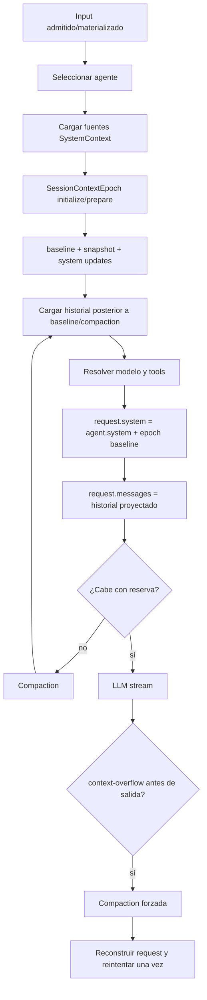

# 04 — Prompt, contexto y compaction

## Alcance

Este análisis reconstruye la evolución del subsistema que decide **qué información recibe el modelo, con qué rol, durante cuánto tiempo y cómo se recupera cuando la ventana de contexto se agota**. La referencia normativa es `dev`; las demás branches se tratan como evidencia arqueológica de diseños anteriores, experimentos o líneas todavía no integradas.

Se analizaron las familias `prompt-*`, `context-*`, `compaction-*`, `instruction-*`, `system-context`, `namespace-instructions`, `read-instruction-*`, además de ramas relacionadas con overflow, summaries, prompt materialization y límites de contexto.

## Convenciones de evidencia

- **CONFIRMADO EN `dev`**: comportamiento observado directamente en el código vigente de `dev`.
- **CONFIRMADO EN BRANCH**: comportamiento demostrado por código/commit de una branch, sin asumir que siga vigente.
- **NO VIGENTE / EXPERIMENTO**: diseño de branch que difiere materialmente de `dev`.
- **INFERENCIA**: conclusión arquitectónica apoyada por varias evidencias pero no expresada como contrato explícito.

## Resultado principal

**CONFIRMADO EN `dev`: OpenCode ya no tiene un único “system prompt” estático.** El request al LLM se construye como la combinación ordenada de:

1. `agent.info.system` del agente seleccionado.
2. Un **baseline persistente de contexto privilegiado**, producido por `SystemContext` y administrado por `SessionContextEpoch`.
3. El historial canónico posterior al baseline/última compaction, donde pueden aparecer updates `system` cronológicos.
4. Un checkpoint de compaction, cuando existe, convertido deliberadamente en mensaje `user` y marcado como **contexto histórico, no instrucciones nuevas**.
5. Mensajes de usuario, assistant, tool calls/results, shell y attachments materializados.

El modelo mental más útil es el siguiente:

## Arquitectura vigente resumida

### System context y contexto de proyecto

`packages/core/src/system-context/index.ts` define fuentes tipadas, refrescables e independientes. Cada fuente conoce cómo producir su `baseline`, cómo describir un `update` y, opcionalmente, cómo expresar su eliminación. Un valor `unavailable` significa fallo transitorio de observación y **no** eliminación de una instrucción previamente admitida.

`packages/core/src/system-context/builtins.ts` aporta, entre otros datos, working directory, workspace root, estado Git, plataforma y fecha actual. `packages/core/src/instruction-context.ts` aporta las instrucciones ambientales `AGENTS.md`.

### Context epoch / checkpoint de creencias

`packages/core/src/session/context-epoch.ts` persiste por sesión un baseline, un snapshot codificado por fuente y la secuencia a la que corresponde. El snapshot representa el contexto privilegiado que el modelo ya conoce, no simplemente el estado actual del filesystem. Las diferencias posteriores se narran como mensajes `system` cronológicos. Una compaction completada crea una frontera en la que el sistema puede sustituir/rebaselinar el contexto.

Esta arquitectura es la evolución directa de las ideas exploradas en `context-checkpoint`, `system-context` y `feat/core-v2-session-context-epoch`.

### Compaction y continuidad

`packages/core/src/session/compaction.ts` resume el tramo antiguo del historial y conserva una cola reciente. El resumen se estructura en objetivo, detalles importantes, estado de trabajo, siguiente movimiento y archivos relevantes. El resumen anterior se mezcla con contexto más reciente para conservar decisiones y restricciones.

`packages/core/src/session/runner/to-llm-message.ts` convierte la compaction en un mensaje `user` dentro de `<conversation-checkpoint>`, con una advertencia explícita para tratarlo como historia y **no como nuevas instrucciones**. Esta separación es una defensa de precedencia: las instrucciones privilegiadas siguen en system context; el resumen conserva memoria conversacional.

### Overflow y retry

El runner intenta compaction proactiva antes de inferir cuando el request estimado supera `context - max(outputBudget, buffer)`. Si el proveedor devuelve `context-overflow` **antes de que haya empezado salida assistant**, intenta compaction reactiva y reconstruye el request. Esa recuperación consume una sola oportunidad; no se crea un bucle de retries.

La semántica aparece históricamente en `feat/core-v2-overflow-recovery` y permanece, con otra estructura, en `dev`.

## Documentos

- [`01-system-context/README.md`](01-system-context/README.md): construcción del system prompt, fuentes, context epoch y updates.
- [`02-instructions/README.md`](02-instructions/README.md): `AGENTS.md`, instrucciones heredadas/dinámicas y evolución de discovery.
- [`03-compaction/README.md`](03-compaction/README.md): algoritmo vigente y familias experimentales de compaction.
- [`04-overflow-limits-retry/README.md`](04-overflow-limits-retry/README.md): límites, reservas, overflow y retry.
- [`05-prompt-pipeline-continuity/README.md`](05-prompt-pipeline-continuity/README.md): materialización, metadata, historial y continuidad entre turns.
- [`06-branch-inventory/README.md`](06-branch-inventory/README.md): inventario y clasificación de branches del alcance.

## Referencias primarias de `dev`

- `packages/core/src/session/runner/llm.ts`
- `packages/core/src/session/runner/to-llm-message.ts`
- `packages/core/src/session/history.ts`
- `packages/core/src/session/compaction.ts`
- `packages/core/src/session/context-epoch.ts`
- `packages/core/src/system-context/index.ts`
- `packages/core/src/system-context/builtins.ts`
- `packages/core/src/instruction-context.ts`
- `packages/core/src/agent.ts`

## Conclusión arquitectónica

**INFERENCIA, confianza alta:** la evolución observada va desde “reconstruir y concatenar prompts/instrucciones en cada turno” hacia un modelo de **estado contextual durable**. En ese modelo, OpenCode conserva por separado:

- autoridad/instrucciones privilegiadas;
- creencias del modelo sobre fuentes dinámicas;
- historia conversacional reducible;
- cola reciente exacta;
- metadata/proveedor necesaria para continuidad técnica.

Esto reduce dos fallos clásicos en agentes largos: reinyectar instrucciones obsoletas como si fueran actuales y convertir un resumen histórico en una nueva instrucción de máxima prioridad.