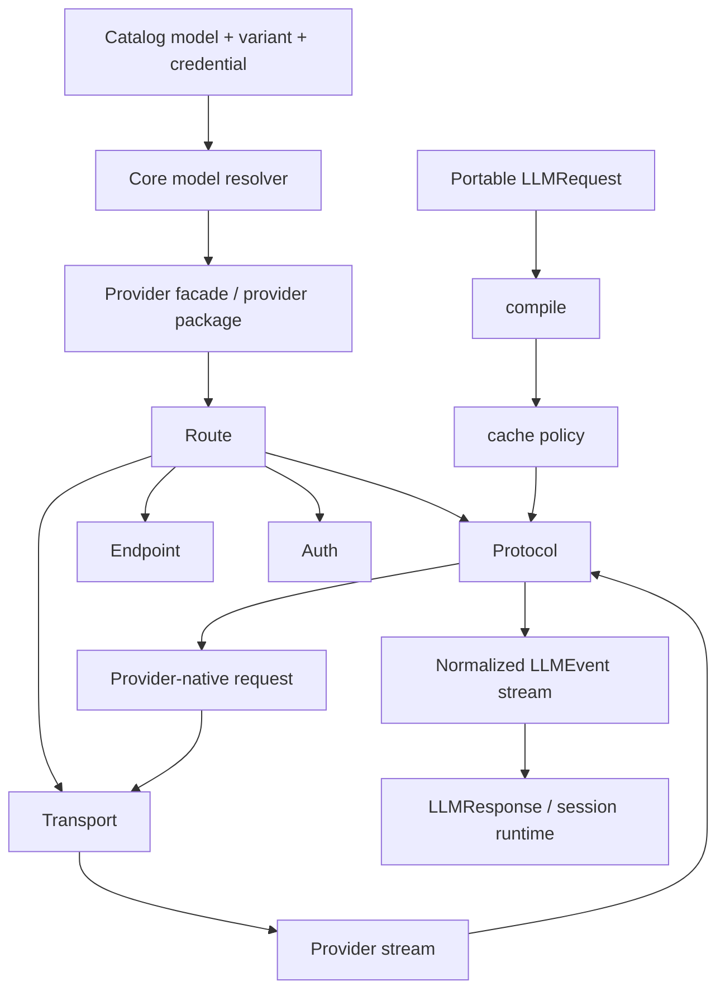

# AGENT 06 — Providers, LLM runtime y protocolos

## Objetivo

Este árbol reconstruye la arquitectura de providers/LLM de OpenCode y su evolución a partir de `dev` y de las familias de branches relacionadas con providers, protocolos, reasoning, streaming, Responses API y retirada de AI SDK.

La documentación diferencia explícitamente:

- **[HECHO]**: comportamiento demostrable en código, tests, documentación técnica o diff de branch.
- **[INFERENCIA]**: conclusión arquitectónica derivada de varias evidencias, pero no declarada como contrato por el código.
- **[HISTÓRICO]**: comportamiento de una branch que no debe asumirse vigente en `dev`.
- **[PENDIENTE]**: hueco que aparece deliberadamente abierto o sin paridad completa.

Baseline principal: `dev`.

## Conclusión ejecutiva

**[HECHO]** `dev` ya no trata el acceso a modelos como una llamada directa a un SDK monolítico. Existe un paquete independiente `packages/llm` con un modelo intermedio normalizado y cuatro capas principales:

1. **Provider facade**: configuración amigable para un proveedor (`openai`, `anthropic`, `google`, `azure`, `amazon-bedrock`, `xai`, etc.).
2. **Route**: composición de protocol + endpoint + auth + transport + defaults.
3. **Protocol adapter**: lowering del request portable al wire format y raising del stream nativo a eventos comunes.
4. **LLM runtime**: compilación, ejecución, retry, normalización de errores, tool events, reasoning y usage.

Los protocolos nativos principales encontrados en `dev` son:

- `packages/llm/src/protocols/openai-responses.ts`
- `packages/llm/src/protocols/openai-chat.ts`
- `packages/llm/src/protocols/openai-compatible-chat.ts`
- `packages/llm/src/protocols/anthropic-messages.ts`
- `packages/llm/src/protocols/gemini.ts`
- `packages/llm/src/protocols/bedrock-converse.ts`

**[HECHO]** Un provider no equivale a un protocolo. Azure reutiliza OpenAI Responses/Chat; xAI reutiliza Responses y OpenAI-compatible Chat; Google Developer API usa Gemini; Bedrock usa Converse y framing AWS propio.

**[HECHO]** `packages/core/src/session/runner/model.ts` en `dev` todavía sólo resuelve de forma nativa un subconjunto del catálogo heredado de AI SDK:

- `@ai-sdk/openai` → `OpenAIResponses.route`
- `@ai-sdk/anthropic` → `AnthropicMessages.route`
- `@ai-sdk/openai-compatible` con URL explícita → `OpenAICompatibleChat.route`

El paquete `packages/llm` soporta más providers que ese resolver.

**[INFERENCIA]** La arquitectura está en una migración por estrangulamiento: primero se construye un runtime/protocol stack propio y después se desplaza la resolución del catálogo desde paquetes `@ai-sdk/*` hacia provider packages nativos, sin obligar a reescribir a la vez sesión, catálogo y todos los proveedores.

## Mapa del runtime

La separación tiene una consecuencia importante: autenticación, routing y transporte se pueden variar sin duplicar el parser del protocolo, y un mismo proveedor puede exponer varias APIs.

## Hallazgos principales

### Abstracción de provider

**[HECHO]** `packages/llm/src/provider.ts` define una abstracción estructural pequeña y desaconseja un registry global para los built-ins; éstos prefieren facades explícitas `configure(options).model(id)`.

**[HECHO]** `packages/schema/src/provider.ts` conserva una representación de catálogo capaz de distinguir `aisdk` y `native`. Esa representación pertenece al plano de configuración/catálogo, no al wire protocol.

### Preparación de requests

**[HECHO]** `packages/llm/src/route/client.ts` convierte configuración de route + defaults de modelo + opciones del request en un request preparado. El límite `compile` aplica cache policy, ejecuta el lowering del protocolo, valida schema y prepara transporte sin hacer I/O de proveedor.

### Streaming

**[HECHO]** los parsers convierten streams incompatibles en un vocabulario común:

`step-start`, `text-start/delta/end`, `reasoning-start/delta/end`, `tool-input-start/delta/end`, `tool-call`, `tool-result`, `tool-error`, `step-finish`, `finish`, `provider-error`.

### Tool calls

**[HECHO]** las tools ejecutadas por el propio proveedor se distinguen con `providerExecuted: true`. OpenAI Responses y Anthropic Messages pueden representar hosted/server-side tools sin mezclarlas con tools locales del agente.

### Reasoning y continuación

**[HECHO]** la continuidad no se reduce a reenviar texto. Cada wire protocol conserva metadata opaca necesaria para continuar:

- OpenAI: item ids y `encrypted_content` de reasoning.
- Anthropic: thinking `signature`.
- Gemini: `thoughtSignature`.
- Bedrock: reasoning signature.

### Retry y errores

**[HECHO]** `packages/llm/src/route/executor.ts` centraliza retry HTTP y clasificación de errores. Hay 2 reintentos por defecto, backoff exponencial con jitter, soporte de `retry-after`, extracción de rate-limit headers y redacción de secretos.

### Caching

**[HECHO]** `packages/llm/src/cache-policy.ts` aplica por defecto una estrategia `auto`: último tool definition, última parte de system y último mensaje de usuario. Sólo Anthropic y Bedrock reciben cache markers inline; OpenAI/Gemini siguen mecanismos propios.

### Usage y coste

**[HECHO]** el contrato común normaliza tokens inclusivos y breakdown no solapado: input, output, fresh input, cache read/write y reasoning tokens. Se conserva además el usage bruto como `providerMetadata`.

**[HECHO]** la capa LLM no promete facturación. `packages/llm/DESIGN.md` declara las garantías de billing/cost accounting como no-objetivo. La evolución posterior mueve la tarifa/model pricing al resolver de catálogo (`Resolved.cost`) mientras el protocolo se limita a reportar usage.

**[INFERENCIA]** esto evita contaminar los adapters de wire protocol con política de precios, que cambia independientemente del protocolo.

## Familias de evolución identificadas

1. **Provider abstraction / configuration** — `provider-*`, `native-provider-*`, `facade/provider`, refactors de provider config y credentials.
2. **LLM runtime propio** — `llm-*`, `ai-native-routing`, `remove-ai-sdk`, `openai-compatible-native-ai`.
3. **OpenAI Responses y Open Responses** — `responses-*`, `openai-*`, `openresponses-audit`, reasoning/replay/websocket.
4. **Reasoning/stream terminal contract** — `reasoning-*`, `stream-*`, `midstream-errs`, `llm-terminal-contract`.
5. **Anthropic** — thinking, tool ordering, transformaciones y compatibilidad Messages.
6. **Gemini/Vertex** — thinking signatures, schema lowering, OAuth/ADC, multi-region y APIs Vertex múltiples.
7. **Bedrock** — SigV4, region, credential chain, event stream, cache points.
8. **Azure** — resource/baseURL, `api-key`, Responses/Chat y auth adicional en branches.
9. **DeepSeek/xAI/OpenAI-compatible** — perfiles compatibles y elección de protocolo.

## Índice

- [`branches/inventario-y-evolucion.md`](branches/inventario-y-evolucion.md) — inventario y lectura evolutiva de branches.
- [`architecture/runtime-comun.md`](architecture/runtime-comun.md) — provider abstraction, model resolution, auth, routing, request preparation, retry, cache, usage y errores.
- [`protocols/openai-responses.md`](protocols/openai-responses.md) — Responses API, replay, reasoning, hosted tools, HTTP/WebSocket.
- [`protocols/anthropic-gemini-bedrock.md`](protocols/anthropic-gemini-bedrock.md) — Messages, Gemini y Converse.
- [`providers/provider-specific.md`](providers/provider-specific.md) — Azure, Vertex, DeepSeek, xAI y compatibilidad.
- [`migration/native-stack-y-remove-ai-sdk.md`](migration/native-stack-y-remove-ai-sdk.md) — migración desde AI SDK y arquitectura objetivo observada.

## Fuentes de mayor peso

Baseline `dev`:

- `packages/llm/DESIGN.md`
- `packages/llm/src/llm.ts`
- `packages/llm/src/provider.ts`
- `packages/llm/src/route/client.ts`
- `packages/llm/src/route/auth.ts`
- `packages/llm/src/route/executor.ts`
- `packages/llm/src/cache-policy.ts`
- `packages/llm/src/schema/events.ts`
- `packages/core/src/session/runner/model.ts`
- `packages/schema/src/provider.ts`

Branches especialmente informativas:

- `native-provider-stack`
- `remove-ai-sdk`
- `responses-item-replay`
- `responses-reasoning`
- `bedrock-credential-chain`
- `vertex-multiregion`

La branch `remove-ai-sdk` incluye `packages/ai/STATUS.md`, una matriz explícita de paridad revisada el 2026-08-07. Se usa como evidencia histórica, no como descripción automática de `dev`.
