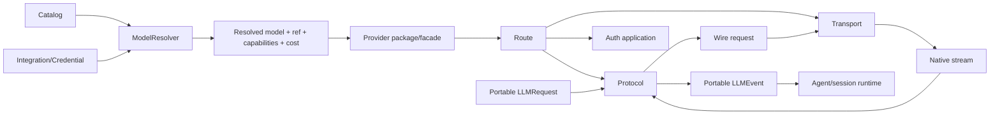

# Migración al stack nativo y retirada de AI SDK

## Tesis

**[INFERENCIA]** La evolución de providers de OpenCode se entiende mejor como una migración por etapas desde AI SDK hacia un kernel LLM propio, no como una reescritura instantánea.

La evidencia combina:

- `llm-centralization`;
- familia `llm-native-*`;
- familia `native-provider-*`;
- `ai-native-routing`;
- `native-provider-stack`;
- `remove-ai-sdk`;
- `bedrock-credential-chain`;
- `dev` actual.

## Etapa 0 — Provider runtime acoplado a sesión/AI SDK

**[HISTÓRICO]** En generaciones tempranas, la capa que prepara el modelo está más próxima al runtime de sesión y al loader de packages AI SDK.

`llm-centralization` introduce una primera concentración de lógica LLM, pero todavía no muestra el boundary independiente que existe hoy.

**[INFERENCIA]** El problema reconocido en esta etapa era dispersión: model options, provider transforms y streaming estaban demasiado cerca del agent/session loop.

## Etapa 1 — Request/event seams

Branches como:

- `llm-native-request-adapter`;
- `llm-native-event-adapter`;
- `llm-native-inject-client`;
- `llm-service-event-seam`;
- `llm-native-runtime-openai`.

**[INFERENCIA]** Descomponen la dependencia en dos direcciones:

```text
OpenCode request -> native provider request
provider stream -> OpenCode events
```

Esta es la forma fundamental del package `packages/llm` presente en `dev`.

## Etapa 2 — Protocol stack independiente

**[HECHO]** `dev` contiene un package LLM con:

- schema portable;
- provider facades;
- routes;
- auth;
- endpoints;
- transports;
- protocol adapters;
- retry/error normalization;
- cache policy;
- usage normalization.

**[HECHO]** El package puede representar más providers/protocols que los que el core resolver activa desde el catálogo.

**[INFERENCIA]** Esto es un strangler seam: el nuevo subsistema puede alcanzar paridad antes de sustituir el loader antiguo.

## Etapa 3 — Native provider packages

La familia:

- `native-provider-schema`;
- `native-provider-config`;
- `native-provider-core`;
- `native-provider-packages`;
- `native-provider-stack`;
- `native-provider-clean`.

**[HECHO]** `native-provider-stack` toca de manera coordinada provider/model schemas, catalog/config, session model resolution y provider entrypoints.

**[INFERENCIA]** El objetivo es convertir el provider en una unidad cargable con un contrato pequeño de `model(id, settings)`, dejando que core resuelva qué package/facade usar.

## Etapa 4 — `remove-ai-sdk`

Esta branch es la evidencia más explícita de arquitectura objetivo.

### Package `packages/ai`

**[HECHO]** Contiene una expansión/renombrado de la línea `packages/llm` con:

- `llm.ts`;
- `provider.ts`;
- `provider-package.ts`;
- `provider-error.ts`;
- tool runtime;
- image clients/protocols;
- route transports HTTP/WebSocket;
- múltiples provider facades.

### Protocolos

**[HECHO]** Incluye al menos:

- OpenAI Chat;
- Open Responses;
- OpenAI Responses;
- OpenAI-compatible Chat;
- OpenAI-compatible Responses;
- Anthropic Messages;
- Gemini;
- Bedrock Converse;
- image protocols.

### Providers/deployments

**[HECHO]** La branch incluye facades para:

- OpenAI;
- Anthropic;
- Anthropic-compatible;
- Google;
- Vertex Gemini/Chat/Responses/Messages;
- Azure;
- Amazon Bedrock;
- Bedrock Mantle;
- OpenRouter;
- xAI;
- Cloudflare;
- Cerebras;
- DeepInfra;
- Groq;
- TogetherAI;
- ZAI y otros compatibles.

## `STATUS.md`: evidencia contra una interpretación demasiado optimista

`packages/ai/STATUS.md` fue revisado el 2026-08-07.

**[HECHO]** El documento dice explícitamente que el package nativo y el runner no tenían la misma cobertura.

### Nativo usable pero no activado plenamente

- Google Gemini;
- Vertex Gemini;
- Vertex Chat;
- Vertex Responses;
- Vertex Messages;
- Azure;
- Bedrock.

### Runner nativo limitado

**[HECHO]** El runner de esa generación todavía mapea directamente sólo:

- `@ai-sdk/openai`;
- `@ai-sdk/anthropic`;
- `@ai-sdk/openai-compatible` con URL explícita.

El resto puede caer al loader AI SDK.

### Gaps documentados

**[HECHO]** El propio status enumera entre los riesgos:

- runner coverage menor que provider package coverage;
- falta de API-aware selection Chat vs Responses para compatibles;
- Bedrock sin paridad de AWS default credential chain;
- Vertex sin mapping/recorded coverage suficiente;
- Azure sin token/AAD parity;
- provider options tipadas incompletas;
- structured output todavía basado principalmente en synthetic tool;
- cassettes desiguales.

**[INFERENCIA]** La retirada de AI SDK fue deliberadamente retenida hasta obtener paridad en los aspectos operacionales difíciles, no sólo paridad de request JSON.

## Etapa 5 — Resolver como boundary de compatibilidad

`bedrock-credential-chain` muestra una versión posterior de `packages/core/src/model-resolver.ts`.

### Resultado resuelto

**[HECHO]** El resolver devuelve conceptualmente:

```text
Resolved {
  model       // LanguageModel listo para route execution
  ref         // identidad durable del catálogo
  capabilities
  cost        // pricing del catálogo
}
```

**[INFERENCIA]** Esto corrige un acoplamiento peligroso: el provider API model id puede diferir de la identidad persistida/mostrada por OpenCode.

### Mapping heredado

**[HECHO]** El resolver puede recibir un package `@ai-sdk/*`, mapearlo mediante `AISDKNative.map`, y cargar un provider package nativo si existe.

Si no existe mapping, conserva un fallback al loader AI SDK cuando esa dependencia está disponible.

**[INFERENCIA]** Esta es una migration adapter explícita: el catálogo no necesita migrarse atómicamente para probar el runtime nativo.

## Credential ownership

La migración también descubre dónde deben vivir las credenciales.

### En route/protocol

Debe vivir la operación determinista que aplica auth al request:

- bearer/header;
- SigV4;
- query/header API key.

### En core/integration resolver

Debe vivir el lifecycle/discovery:

- OAuth access token;
- AWS profile/default chain;
- credential metadata;
- refresh/re-resolution por turno.

**[HECHO]** `bedrock-credential-chain` implementa exactamente esta separación: core obtiene AWS identity y Bedrock auth sólo firma.

**[INFERENCIA]** Es probable que Azure CLI/AAD y Vertex ADC sigan la misma regla conceptual: auth acquisition fuera del protocol, application dentro de route/facade.

## Provider-specific transforms

**[HECHO]** La migración no elimina transforms provider-specific; los mueve al lugar correcto.

Ejemplos:

- OpenAI reasoning items/item references;
- Anthropic tool ordering y thinking signatures;
- Gemini JSON Schema projection;
- Bedrock cache points/EventStream;
- Vertex endpoint derivation;
- OpenRouter/compatible options.

**[INFERENCIA]** “Remove AI SDK” significa sustituir el runtime/protocol dependency, no eliminar la complejidad propia de los proveedores.

## Streaming contract

Branches `llm-terminal-contract`, `provider-event-tolerance`, `responses-done-message`, `responses-stream-retry`, `bedrock-metadata-terminal`, `gemini-error-frame` revelan un problema común: terminación y error pueden llegar de maneras incompatibles.

**[HECHO]** `dev` resuelve esto con un event vocabulary común y dos paths de error:

- request/transport errors como `LLMError`;
- provider stream failures como eventos/failures normalizados.

**[INFERENCIA]** Estabilizar este terminal contract era requisito para poder cambiar AI SDK por adapters propios sin alterar el agent loop.

## Usage y coste

**[HECHO]** El runtime nativo normaliza usage pero no pricing.

**[HISTÓRICO]** El `ModelResolver` posterior conserva `cost` desde el catálogo junto al model resuelto.

**[INFERENCIA]** La arquitectura objetivo divide:

```text
protocol -> token usage observado
catalog  -> precio/capacidades declaradas
core     -> accounting / policy
```

Esta separación hace posible cambiar precios sin tocar adapters y comparar usage entre protocolos heterogéneos.

## Structured output

**[HISTÓRICO/PENDIENTE]** `STATUS.md` indica que `generateObject` seguía usando principalmente una synthetic tool strategy y que el diseño futuro esperaba structured output nativo donde fuese fiable, con fallback por tools.

**[INFERENCIA]** Éste es un ejemplo de una idea no descartada pero pospuesta por falta de semántica uniforme entre providers.

## Qué fue descartado o evitado

No hay evidencia de que se haya descartado el stack nativo; al contrario, gran parte llegó a `dev`.

Lo que sí parece evitado o retrasado:

1. **Registry global obligatorio de providers built-in.** Las facades explícitas son preferidas.
2. **Asumir OpenAI-compatible = OpenAI.** Se separan profiles y Open Responses.
3. **Acoplar pricing al protocol adapter.** Usage y cost se separan.
4. **Meter credential refresh en el signer/parser.** Resolver e Integration poseen lifecycle.
5. **Activar todos los providers nativos antes de paridad.** Se mantiene fallback AI SDK durante la migración.
6. **Usar model API id como identidad durable.** Resolver posterior conserva `ref` separado.

## Arquitectura objetivo reconstruida



## Relación con `dev`

**[HECHO]** `dev` ya contiene el núcleo de esta arquitectura en `packages/llm`, pero su `SessionRunnerModel` aún muestra el seam transicional al trabajar con `api.type === "aisdk"` y sólo tres mappings directos.

**[INFERENCIA]** Por tanto, `dev` debe interpretarse como una arquitectura nativa ya establecida en el plano LLM/protocol, con una migración de catálogo/provider resolution todavía incompleta o conservadora.

## Conclusión

La principal innovación de esta línea de branches no es un adapter concreto. Es convertir la integración LLM en un subsistema compilable y testeable de forma aislada, con boundaries explícitos entre:

- identidad/model catalog;
- credenciales;
- provider deployment;
- protocolo;
- transporte;
- stream lifecycle;
- agent orchestration.

Esa separación permite reemplazar AI SDK de manera incremental sin exigir que cada provider alcance paridad al mismo tiempo.
