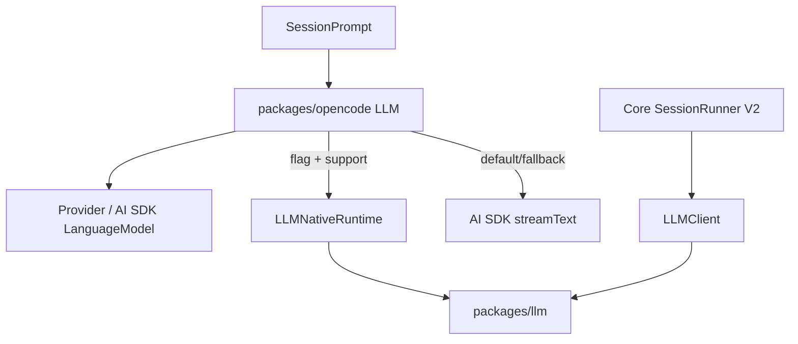

# Migración al stack nativo y retirada de AI SDK

## Tesis corregida

La evolución de providers de OpenCode es una migración por etapas desde AI SDK hacia un kernel LLM propio. En `dev` esa migración está **avanzada pero no completada**.

La distinción esencial es:

- `packages/llm` y el runner Core V2 ya implementan/consumen el stack nativo;
- `packages/opencode/src/session/llm.ts`, usado por el pipeline `SessionPrompt`, mantiene **AI SDK como runtime por defecto**;
- `LLMNativeRuntime` en ese pipeline se activa mediante `experimentalNativeLlm` y puede volver a AI SDK cuando el modelo no está soportado.

Por tanto, una branch llamada `remove-ai-sdk` representa arquitectura objetivo/evidencia histórica, no una prueba de que `dev` haya eliminado AI SDK de todos sus paths.

## Etapa 0 — Provider runtime acoplado a sesión/AI SDK

En generaciones tempranas, model options, provider transforms, streaming y el loader estaban estrechamente ligados al runtime de sesión. `llm-centralization` empieza a concentrar esa lógica.

## Etapa 1 — Request/event seams

Las familias `llm-native-request-*`, `llm-native-event-*`, `llm-service-event-seam` y equivalentes separan dos direcciones:

```text
OpenCode request -> provider/native request
provider/native stream -> OpenCode LLMEvent
```

Esa frontera sobrevive en `dev`.

## Etapa 2 — `packages/llm`

`dev` contiene un package independiente con:

- schema portable;
- provider facades;
- routes;
- auth application;
- endpoint/transport;
- protocol adapters;
- retry/error normalization;
- cache policy;
- usage normalization.

El package soporta más providers/protocols que los que todos los consumidores de `dev` activan actualmente.

## Etapa 3 — Native provider packages

La familia `native-provider-*` trabaja la resolución de catálogo/config/provider packages. La lectura arquitectónica es convertir provider/protocol/transport en unidades reemplazables, dejando el catálogo y credenciales como capas separadas.

## Etapa 4 — Branch `remove-ai-sdk`

Esta línea contiene la evidencia más explícita de una arquitectura donde el stack nativo cubre una superficie amplia de providers y protocolos.

Su `STATUS.md` documentaba todavía gaps de paridad, entre ellos cobertura del runner, Bedrock credentials, Vertex/Azure y structured output. Debe leerse como evidencia de migración, no como baseline automática de `dev`.

## Estado real de `dev`

### A. Pipeline de producto (`packages/opencode`)

`packages/opencode/src/session/llm.ts` ejecuta aproximadamente:

```text
Provider.Service.getLanguage(model)
        |
LLMRequestPrep.prepare(...)
        |
if experimentalNativeLlm:
    LLMNativeRuntime.stream(...)
      supported -> native LLMEvent stream
      unsupported -> fallback
        |
DEFAULT -> ai.streamText(...)
        |
LLMAISDK normalization -> LLMEvent
```

El comentario del propio source denomina el último camino **Default runtime path**.

Esto significa que AI SDK sigue siendo una dependencia operacional del agent loop legacy-compatible, no sólo código residual.

### B. Pipeline Core V2

`packages/core/src/session/runner/llm.ts` trabaja con `LLMClient.Service` y `LLM.request()` directamente. Éste es el consumidor más claro del stack `@opencode-ai/llm` como runtime primario.

`SessionRunnerModel` sigue mostrando una migración de catálogo incompleta: el mapping directo desde APIs etiquetadas como AI SDK cubre un subconjunto concreto y no todo el catálogo soportado por `packages/llm`.

## Credential ownership

La separación conceptual sigue siendo válida:

- route/protocol: aplicar auth determinista al wire request;
- integration/core/provider layer: adquirir/refrescar credenciales, perfiles, OAuth/ADC/default chains.

Las branches de Bedrock, Azure y Vertex son evidencia de esta frontera, pero cada provider debe comprobarse contra `dev` antes de afirmar paridad completa.

## Provider-specific transforms

Retirar AI SDK no elimina diferencias de proveedor. Las desplaza a adapters/facades apropiados:

- reasoning/replay OpenAI;
- thinking/tool ordering Anthropic;
- schema/thought signatures Gemini;
- SigV4/event stream/cache Bedrock;
- endpoints/credentials de deployments como Vertex/Azure.

## Streaming contract

El vocabulario `LLMEvent` común permite que SessionProcessor y SessionRunner trabajen sobre eventos normalizados aunque el executor sea AI SDK o nativo. Este seam es precisamente lo que hace posible la migración incremental.

## Usage y coste

El stack nativo normaliza usage, no pricing universal. En paralelo, el path `packages/opencode` todavía tiene lógica de accounting/provider metadata en `Session.getUsage()`. La concentración total de accounting tampoco debe darse por completada.

## Structured output

Structured output continúa dependiendo del consumidor. `SessionPrompt` puede materializar una tool sintética `StructuredOutput`; la existencia de protocolos con capacidades nativas no implica que todos los paths las utilicen uniformemente.

## Qué está integrado y qué no

### Integrado en `dev`

- package `packages/llm` y protocolos nativos;
- `LLMEvent` como vocabulario común;
- native request/event seams;
- Core V2 usando `LLMClient`;
- native runtime opcional en `packages/opencode`;
- fallback explícito a AI SDK.

### No consumado globalmente

- eliminación de AI SDK del pipeline `SessionPrompt`;
- activación nativa de todos los providers del catálogo;
- unificación absoluta de credentials/accounting/structured output en una sola capa.

## Arquitectura de transición



## Conclusión

La dirección hacia un stack nativo está respaldada por mucho código real, pero la documentación debe medir “migrado” por el composition/runtime path, no por la mera presencia de adapters. A `dev@dc4449df...`, AI SDK sigue siendo el executor por defecto de `SessionPrompt`, mientras Core V2 ya opera directamente sobre el runtime nativo.